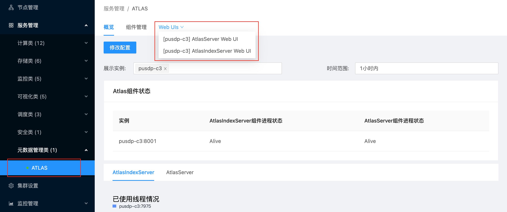
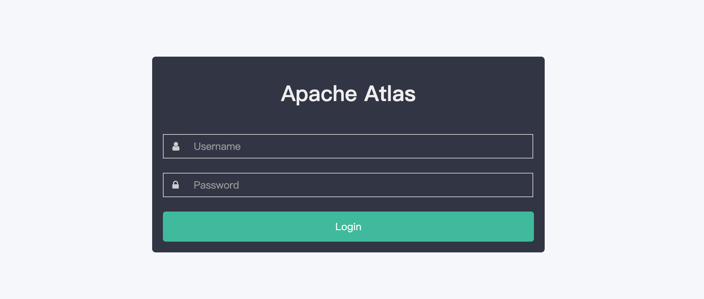

# USDP 开发指南-ATLAS

Apache Atlas 是 Hadoop 社区为解决 Hadoop 生态系统的元数据治理问题而产生的开源项目，它为Hadoop 生态系统集群提供了包括数据分类、集中策略引擎、数据血缘、安全和生命周期管理在内的元数据治理核心能力。

## Atlas 使用示例

### 1. 登录Atlas Web UI

点击 USDP 控制台左侧导航菜单 <kbd>服务管理</kbd> - <kbd>元数据管理类</kbd> - <kbd>ATLAS</kbd> ，进入ATLAS详情页，点击 <kbd>Web UIs</kbd> 即可打开当前集群的 UDS 任务管理服务控制台。





管理员账号，参见 [各服务Web UIs登录账号](/USDP/operate/login) 指南文档。

### 2. Atlas Web UI首页


### 3. 全量导入数据
USDP 使用 Atlas 管理 Hive 数据，可以通过以下脚本把 hive 数据全量导入 atlas 。

```shell
sh /srv/udp/1.0.0.0/atlas/bin/import-hive.sh
```

### 4. 实时同步

通过利用 beeline 客户端可以远程连接 Hive-server2 服务（或使用 Hive 服务提供的一个方便操作 Hive 表的 Hive Cli），创建对应的业务所需的表。

```sql
create database atlas1;
use atlas1;
CREATE TABLE t_udp_service_component_mapping(id INT,service_name STRING,component_name STRING,max_living_count INT,required INT,create_time INT,update_time INT);
create table t_udp_service_component_mapping_upadate as select * from t_udp_service_component_mapping;
insert into t_udp_service_component_mapping_upadate  select * from t_udp_service_component_mapping;
create table t_udp_service_component_mapping_old as select * from t_udp_service_component_mapping_upadate;
insert into  t_udp_service_component_mapping_old select * from t_udp_service_component_mapping;
```

WebUI 可以实时搜索到如下 Hive 表，如下图所示：


### 5. Hive 元数据 Lineage 查看

Atlas WebUI 搜索到某个表后，可以看到这个表的  Lineage，如上面创建的 t_udp_service_component_mapping_old，如下图所示：

