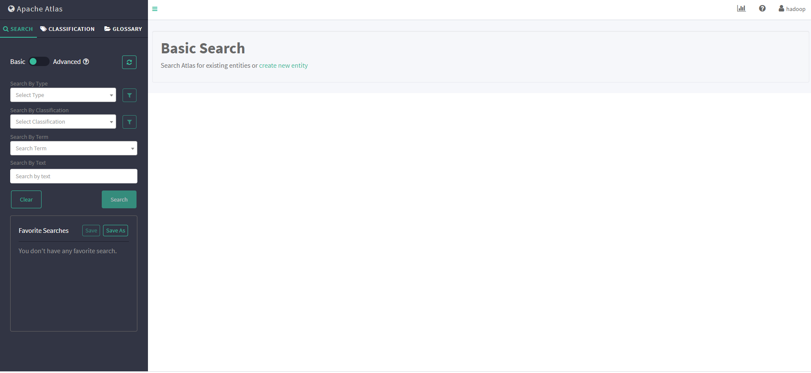
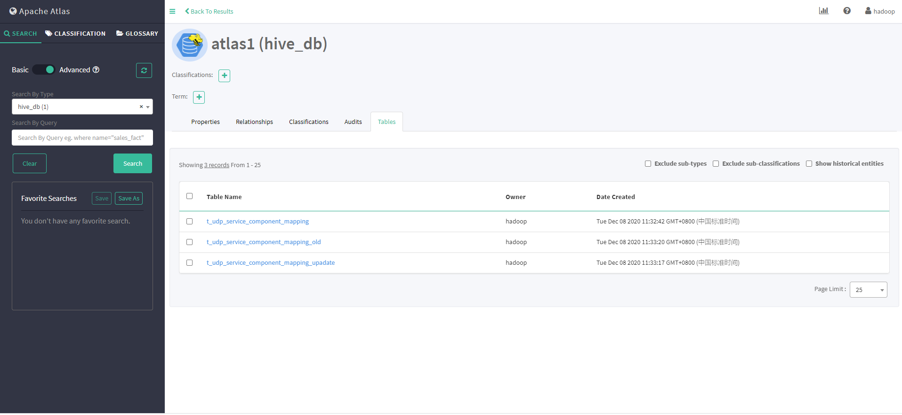
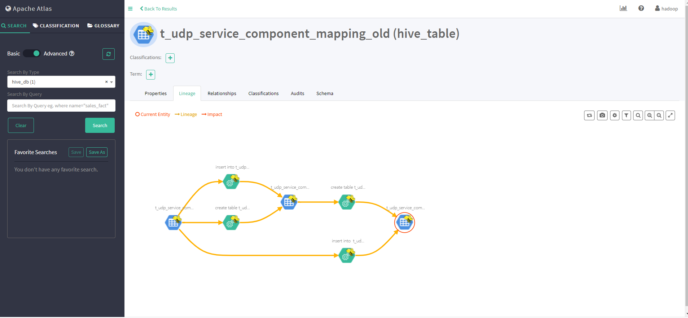

# USDP 开发指南-ATLAS

Apache Atlas 是 Hadoop 社区为解决 Hadoop 生态系统的元数据治理问题而产生的开源项目，它为Hadoop 生态系统集群提供了包括数据分类、集中策略引擎、数据血缘、安全和生命周期管理在内的元数据治理核心能力。

## Atlas 使用实例

设置 Atlas  访问端口为 21313，通过安装节点 IP:21313 访问 ，如 http://192.168.1.1:21313。进入如下界面，默认用户名和密码为 hadoop，hadoop，如下图所示：



- ### 全量导入数据
  - USDP 使用 Atlas 管理 Hive 数据，可以通过以下脚本把 hive 数据全量导入 atlas 。

    ```shell
    sh /srv/udp/1.0.0.0/atlas/bin/import-hive.sh
    ```

- ### 实时同步

  - 通过利用 beeline 客户端可以远程连接 Hive-server2 服务（或使用 Hive 服务提供的一个方便操作 Hive 表的 Hive Cli），创建对应的业务所需的表。

    ```sql
    create database atlas1;
    use atlas1;
    CREATE TABLE t_udp_service_component_mapping(id INT,service_name STRING,component_name STRING,max_living_count INT,required INT,create_time INT,update_time INT);
    create table t_udp_service_component_mapping_upadate as select * from t_udp_service_component_mapping;
    insert into t_udp_service_component_mapping_upadate  select * from t_udp_service_component_mapping;
    create table t_udp_service_component_mapping_old as select * from t_udp_service_component_mapping_upadate;
    insert into  t_udp_service_component_mapping_old select * from t_udp_service_component_mapping;
    ```

    WebUI 可以实时搜索到如下 Hive 表，如下图所示：

    

- ### Hive 元数据 Lineage 查看
  - Atlas WebUI 搜索到某个表后，可以看到这个表的  Lineage，如上面创建的 t_udp_service_component_mapping_old，如下图所示：

    