# USDP 开发指南-RANGER

RANGER 是 Hadoop 生态中的权限管理框架，可以对 HDFS、Hive 等组件进行细粒度的权限访问控制，并且开发者可以通过其自带的 WebUI 进行授权管理操作。

HDFS 作为底层存储，下面以 HDFS 为例，进行说明。

## 1. Ranger 与 HDFS

### 1.1 启用  HDFS-Ranger 插件

#### 1.1.1 登陆NameNode所在集群节点并完成下述操作

首先需要分别在两台 NameNode 节点上开启 HDFS Ranger 插件，并重启集群，命令如下：

~~~shell
/srv/udp/1.0.0.0/hdfs/ranger-hdfs-plugin/enable-hdfs-plugin.sh 
~~~

此时会在当前节点的如下目录自动生成相关权限配置：

~~~xml
/srv/udp/1.0.0.0/hdfs/etc/hadoop/hdfs-site.xml
<property>
    <name>dfs.permissions.enabled</name>
    <value>true</value>
</property>
<property>
    <name>dfs.permissions</name>
    <value>true</value>
</property>
<property>
    <name>dfs.namenode.inode.attributes.provider.class</name>
    <value>org.apache.ranger.authorization.hadoop.RangerHdfsAuthorizer</value>
</property>
~~~

并自动在该目录下生成软链接：

~~~shell
/srv/udp/1.0.0.0/hdfs/share/hadoop/hdfs/lib
ranger-hdfs-plugin-impl -> /srv/udp/1.0.0.0/hdfs/ranger-hdfs-plugin/lib/ranger-hdfs-plugin-impl
ranger-hdfs-plugin-shim-1.2.0.jar -> /srv/udp/1.0.0.0/hdfs/ranger-hdfs-plugin/lib/ranger-hdfs-plugin-shim-1.2.0.jar
ranger-plugin-classloader-1.2.0.jar -> /srv/udp/1.0.0.0/hdfs/ranger-hdfs-plugin/lib/ranger-plugin-classloader-1.2.0.jar
~~~

``注意：此时，需要通过 USDP 控制台重启两个NameNode，参见1.1.2节``

#### 1.1.2 在USDP控制台完成两个NameNode服务重启

进入左侧导航栏“节点管理”中，分别点击节点域名为“usdp-xxx-master1”、“usdp-xxx-master2”进入节点详情页，点击“组件管理”，寻找到“NameNode1”、“NameNode2”组件后，点击响应的组件操作栏 <kbd>重启</kbd> 按钮。

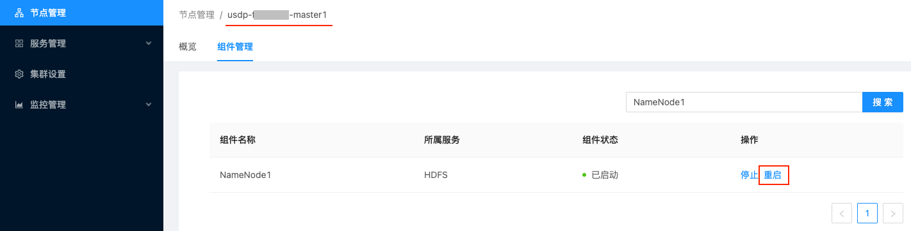

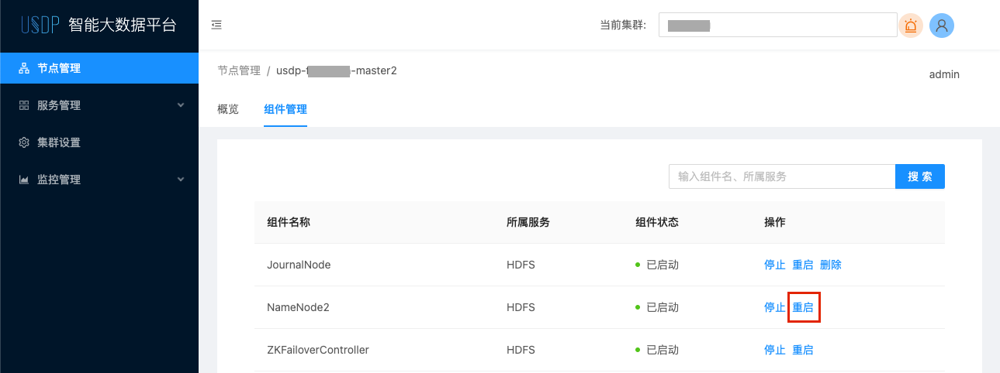

### 1.2 配置权限

#### 1.2.1 访问 Ranger Web UI 页面

此时可以通过控制台访问 Ranger Web UI页面，举例连接如下：

~~~URI
http://usdp-xxx-master1:6080/login.jsp
~~~

此时可以查看到如下页面：

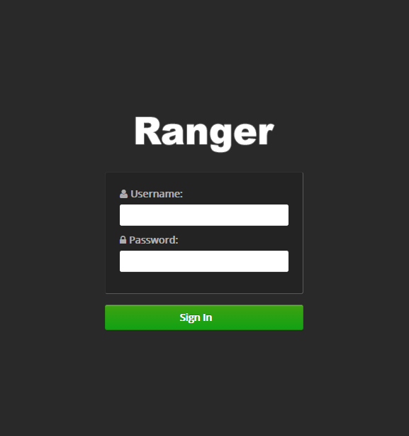

``注：默认登录的账号：admin，密码为：admin``

#### 1.2.2 添加 HDFS-Service

在 HDFS 条目中，点击  <kbd>+</kbd>添加 Service，如下图所示：

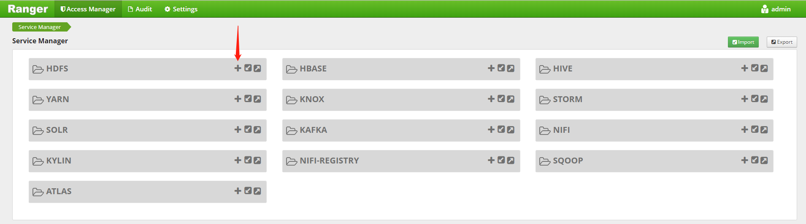

并在 Service Name 输入框中填入如下值：（注意，此处必须为此值）

~~~shell
ranger-hdfs-service
~~~

#### 1.2.3 配置 HDFS-Service 用户名密码

设置用户名密码为如下：

~~~shell
Username：hadoop
Password：hadoop
~~~

#### 1.2.4 配置 NameNode HA 参数

在 NameNode URL 中填入如下配置：

~~~shell
hdfs://usdp-xxx-master1:8020,hdfs://usdp-xxx-master2:8020
~~~

填入规则如下图所示：

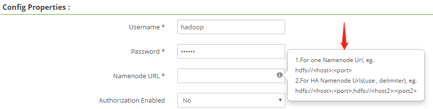

#### 1.2.5 配置代理参数

在下方 Add New Configuration 中配置代理参数如下：

~~~shell
policy.download.auth.users: hadoop
~~~

配置完成后如下图所示：

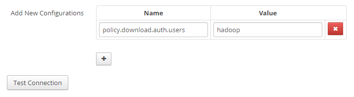

然后点击 Test Connection 按钮，如果得到如下图所示样例，则表示成功。

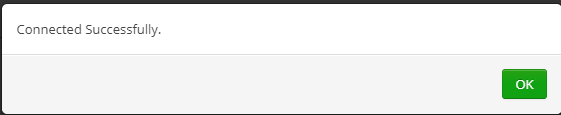

最后，点击 Add 按钮，此时Ranger Web UI的Service Manager页面显示如下：

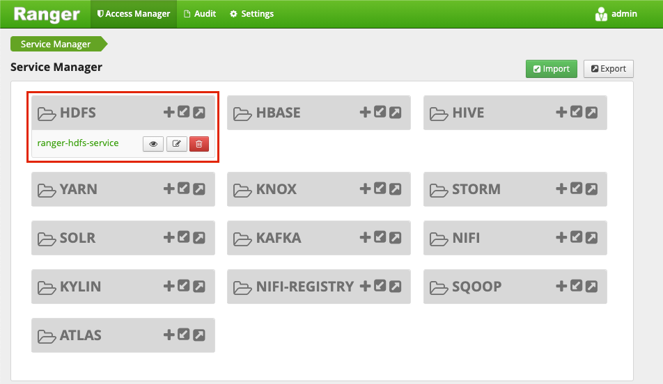

### 1.3  添加测试用户

#### 1.3.1 添加用户

在 Ranger Web UI 中，点击 Settings-Add New User 添加测试用户，如下图所示：

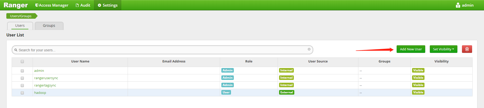

编辑内容如下图所示：

``注：Select Role 中，选择 User 类型，而非 Admin 类型。``

#### 1.3.2 在 Linux 中添加用户

在 Linux 中，需要添加与上述配置相同的用户，命令如下：

~~~shell
useradd test1
~~~

#### 1.3.3  验证用户当前权限

在 Linux 中，使用如下命令，验证 test1 用户拥有对应权限：

~~~shell
su -s /bin/bash test1 -c "/srv/udp/1.0.0.0/hdfs/bin/hdfs dfs -ls /"
~~~

返回如下：

~~~shell
drwxrwxr-x   - hadoop supergroup          0 2020-11-06 11:28 /flink-completed-jobs
drwxr-xr-x   - hadoop supergroup          0 2020-11-06 11:30 /hbase
drwxr-xr-x   - hadoop supergroup          0 2020-11-06 11:29 /kylin
drwxrwxr-x   - hadoop supergroup          0 2020-11-06 11:28 /spark-logs
drwxr-xr-x   - hadoop supergroup          0 2020-11-06 11:27 /tez
drwxrwx---   - hadoop supergroup          0 2020-11-06 11:28 /tmp
drwxr-xr-x   - hadoop supergroup          0 2020-11-06 11:28 /user
~~~

此时证明 test1 有对根目录的访问权限。

### 1.4  编辑权限

接下来以配置拒绝 hadoop 用户访问为例进行说明。

#### 1.4.1 进入编辑页面

如下图所示，即可进入编辑页面：

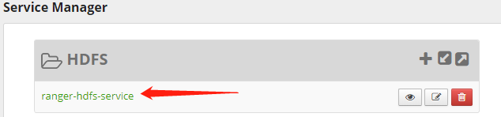

#### 1.4.2 删除默认规则

如下图所示：

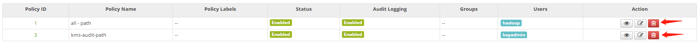

#### 1.4.3 添加自定义规则

点击右上角的“Add New Policy” 即可添加默认规则，如下图所示：

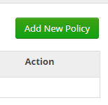

#### 1.4.4 配置 Policy Details

在 Policy Name 属性中，建议键入比较有标识度的规则名称，例如：deny_test1_all，即，拒绝 test1 用户所有对 HDFS 的操作。

同时，在 Resource Path 中输入：/，并键入回车，同时，要确保 recursive 开关开启。

最终配置如下图所示：

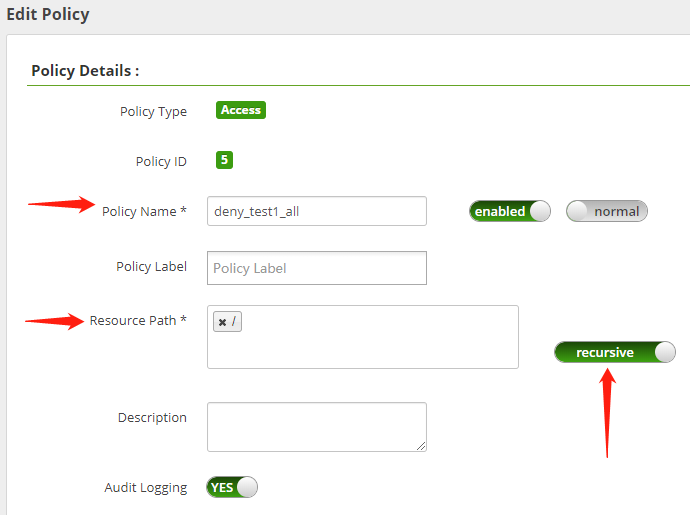

#### 1.4.5 配置权限类型

配置权限可以分为两种类别：允许的权限、拒绝的权限。本例中，以配置拒绝的权限为例进行说明，即，拒绝 test1 用户对 HDFS 根目录及其子目录下的所有操作。如下 “配置拒绝权限” 所示。

* 配置允许的权限

  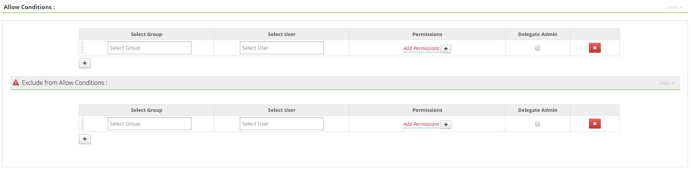

* 配置拒绝的权限

  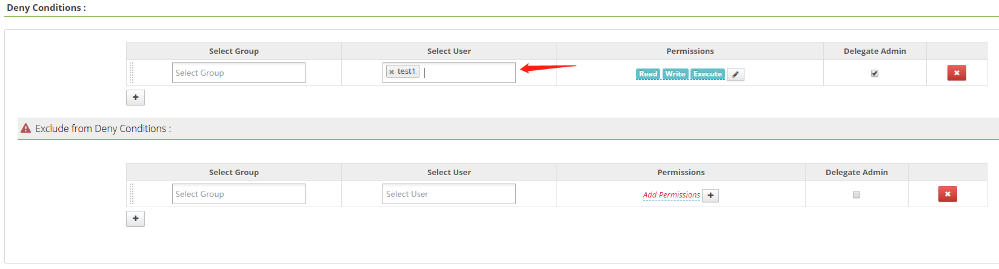

#### 1.4.6 查看配置完成的权限

上述配置完成后，点击 Add，即可完成添加，并回到权限概览页面，如下图所示：

``注：权限添加后，大约 1 分钟之后才会生效。``

### 1.5  验证权限配置

接下来，通过 ssh 访问到安装了 HDFS 服务组件的节点，进行 shell 操作来验证权限是否生效。

试验命令如下：

~~~shell
su -s /bin/bash test1 -c "/srv/udp/1.0.0.0/hdfs/bin/hdfs dfs -ls /"
~~~

返回结果如下：

~~~shell
ls: Permission denied: user=test1, access=EXECUTE, inode="/"
~~~

此时证明权限配置已经生效。

## 2. Ranger 与 Hive

### 2.1 启用 Hive-Ranger 插件

首先需要在 HiveServer2 所在节点上开启 Hive Ranger 插件，并重启集群，命令如下：

~~~shell
/srv/udp/1.0.0.0/hive/ranger-hive-plugin/enable-hive-plugin.sh 
~~~

此时会在当前节点的 Hive 配置文件目录中自动变更如下配置文件：

~~~shell
ll /srv/udp/1.0.0.0/hive/conf

hiveserver2-site.xml
ranger-hive-audit.xml
ranger-hive-security.xml
ranger-policymgr-ssl.xml
ranger-security.xml
~~~

``注意：此时，需要通过 USDP 控制台重启 HiveServer2``

### 2.2 配置权限

#### 2.2.1 访问 Ranger Web UI 页面

此时可以通过控制台访问 Ranger Web UI页面，举例连接如下：

~~~URI
http://usdp-xxx-master1:6080/login.jsp
~~~

此时可以查看到如下页面：

``注：默认登录的账号：admin，密码为：admin``

#### 2.2.2 添加 Hive-Service

在 Hive 条目中，点击 “加号” 添加 Service，如下图所示：

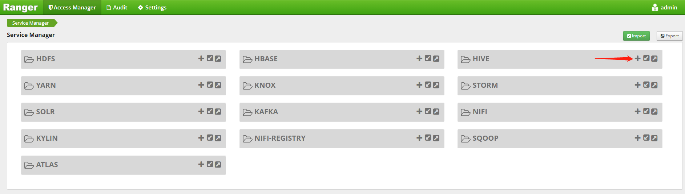

并在 Service Name 输入框中填入如下值：（注意，此处必须为此值）

~~~shell
ranger-hive-service
~~~

#### 2.2.3 设置 Hive-Service 用户名密码

设置用户名密码如下：

~~~shell
Username：hadoop
Password：hadoop
~~~

#### 2.2.4 配置 JDBC 驱动类

设置 `jdbc.driverClassName` 属性值为：org.apache.hive.jdbc.HiveDriver

#### 2.2.5 配置 JDBC URL

此处设置 HiveServer2 的连接即可，配置举例如下，注意：该示例中的 IP 地址为 HiveServer2 所在节点的内网 IP。

~~~shell
jdbc:hive2://10.9.136.30:10000
~~~

#### 2.2.5 配置代理参数

在下方 Add New Configuration 中配置代理参数如下：

~~~shell
policy.download.auth.users: hadoop
~~~

配置完成后如下图所示：

然后点击 Test Connection 按钮，如果得到如下图所示样例，则表示成功。

最后，点击 Add 按钮即可。

### 2.3 添加测试用户

#### 2.3.1 添加用户

在 Ranger Web UI 中，点击 Settings-Add New User 添加测试用户，如下图所示：

编辑内容如下图所示：

``注：Select Role 中，选择 User 类型，而非 Admin 类型。``

#### 2.3.2 在 Linux 中添加用户

在 Linux 中，需要添加与上述配置相同的用户，命令如下：

~~~shell
useradd test1
~~~

#### 2.3.3 验证用户当前权限

在 Linux 中，使用如下命令，验证 test1 用户拥有对应权限：

~~~shell
/srv/udp/1.0.0.0/hive/bin/beeline -u jdbc:hive2://10.9.136.30:10000 -n test1
~~~

然后再 beeline 命令行输入：

~~~shell
0: jdbc:hive2://10.9.136.30:10000> create table t_test(a string);
~~~

结果如下：

~~~shell
0: jdbc:hive2://10.9.136.30:10000> show tables;
+-----------+
| tab_name  |
+-----------+
| t_test    |
+-----------+
~~~

此时证明 test1 有对表操作的权限。

### 2.4 编辑权限

#### 2.4.1 进入编辑页面

如下图所示，即可进入编辑页面：

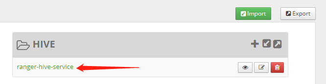

#### 2.4.2 删除默认规则

如下图所示：

#### 2.4.3 添加自定义规则

点击右上角的“Add New Policy” 即可添加默认规则，如下图所示：

#### 2.4.4 配置 Policy Details

在 Policy Name 属性中，建议键入比较有标识度的规则名称，例如：deny_test1_all，即，拒绝 test1 用户所有对 HDFS 的操作。

同时，在 Resource Path 中输入：/，并键入回车，同时，要确保 recursive 开关开启。

最终配置如下图所示：

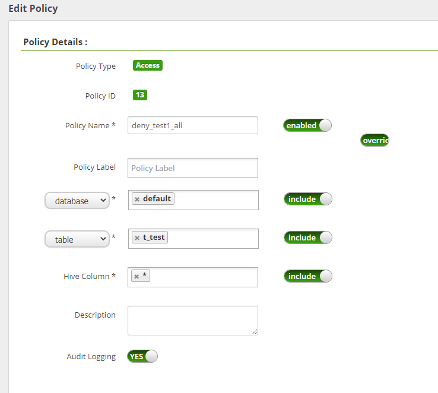

#### 2.4.5 配置权限类型

配置权限可以分为两种类别：允许的权限、拒绝的权限。本例中，以配置拒绝的权限为例进行说明，即，拒绝 test1 用户对 HDFS 根目录及其子目录下的所有操作。如下 “配置拒绝权限” 所示。

* 配置允许的权限

* 

* 配置拒绝的权限

  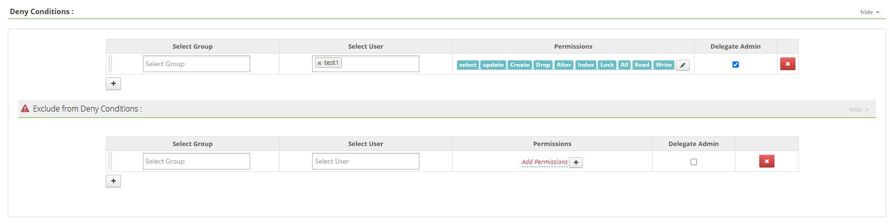

#### 2.4.6 查看配置完成的权限

上述配置完成后，点击 Add，即可完成添加，并回到权限概览页面，如下图所示：

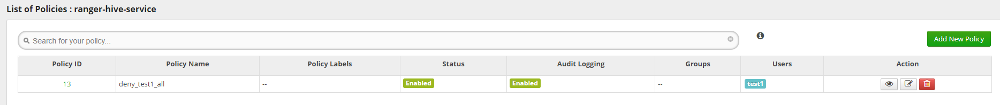

``注：权限添加后，大约 1 分钟之后才会生效。``

### 2.5  验证权限配置

在 Linux 中，使用如下命令，验证 test1 用户拥有对应权限：

~~~shell
/srv/udp/1.0.0.0/hive/bin/beeline -u jdbc:hive2://10.9.136.30:10000 -n test1
~~~

然后再 beeline 命令行输入：

~~~shell
0: jdbc:hive2://10.9.136.30:10000> insert into t_test values('nick');
~~~

结果如下：

~~~shell
Error: Error while compiling statement: FAILED: HiveAccessControlException Permission denied: user [test1] does not have [UPDATE] privilege on [default/t_test] (state=42000,code=40000)
~~~

此时证明 test1 已经失去对 t_test 表的操作权限，更多细粒度的控制，可以在上述 2.4.5 中进行配置。