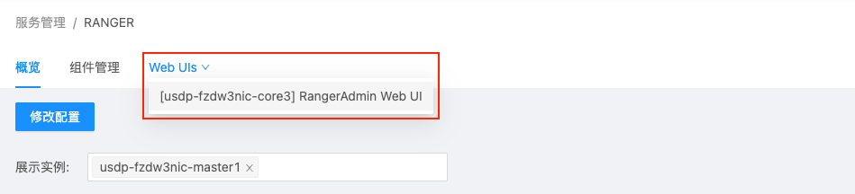

# USDP 开发指南-RANGER

RANGER 是 Hadoop 生态中的一种权限管理框架，通过其可以实现对 HDFS、Hive 等生态组件进行细粒度的权限访问控制，并且 集群管理员 可以通过 Ranger 组件自带的 WebUI 进行相关配置及授权管理操作，以达到集群安全性增强的目的。

在通过使用 USDP 服务创建的 Hadoop 集群中，我们通过本篇指南，以示例的形式带您了解 开发者 及 管理员 如何使用 Ranger ，了解 Ranger 的相关的一些操作方法。

## 访问Ranger UI

目前，当需要访问USDP各组件的Web UIs时，出于安全性考虑，建议您先安全的进入云端内网环境，并使用浏览器访问各组件Web UIs。

1. 进入USDP控制台。

2. 左侧导航栏选择“服务管理”-“安全类”-“Ranger”进入 Ranger 服务管理页面。

3. 选择标签页“Web UIs”即可弹出 RangerAdmin Web UI的链接。

   

4. 点击此链接即可打开。

   

   ``注：默认登录的账号：admin，密码为：admin，建议您及时修改admin用户密码。``

5. 的此时可以通过控制台访问 Ranger Web UI页面，举例连接如下：

您可通过以下方式亦可访问Ranger UI。

~~~URI
http://usdp-xxx-master1:6080/login.jsp
~~~

## 各服务组件集成Ranger

本篇指南，包含如下两章内容：

* [HDFS配置Ranger](/USDP/developer/ranger/ranger_hdfs)

* [Hive配置Ranger](/USDP/developer/ranger/ranger_hive)

`注意：本篇指南是以USDP V1.0.0.0版本，涉及的集群组件的部署路径`参见[各服务部署规则](/USDP/developer/rule)。

