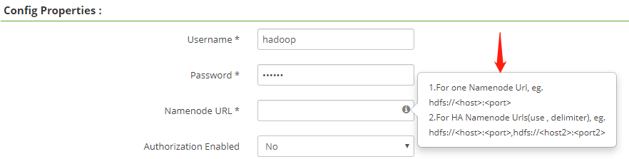
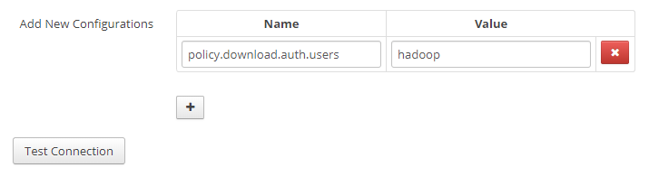
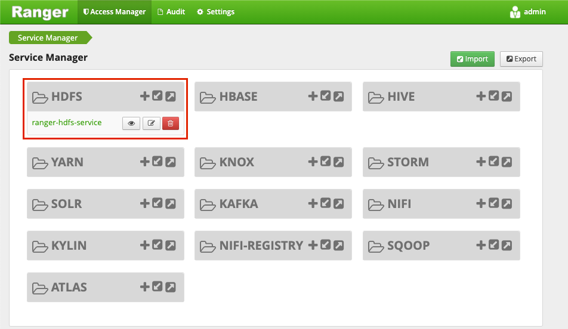
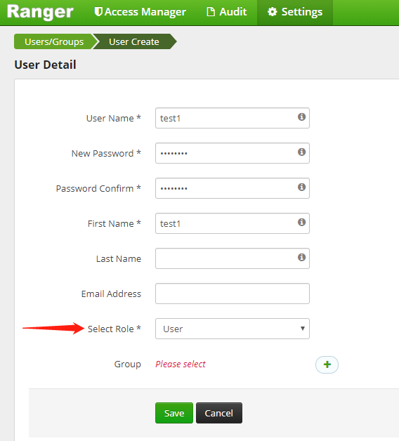
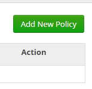
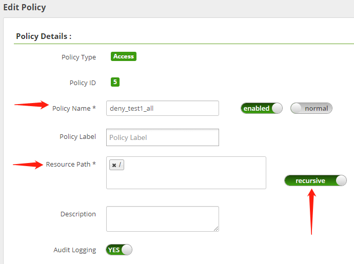
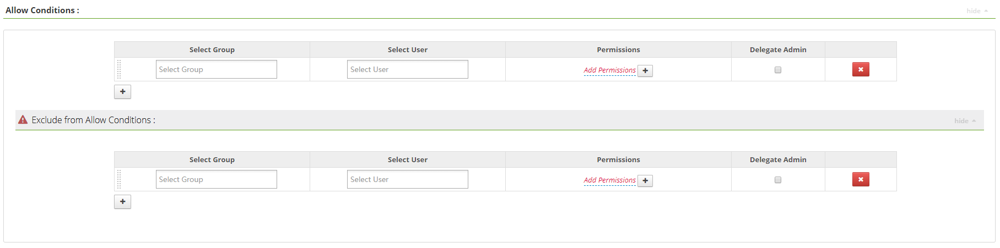
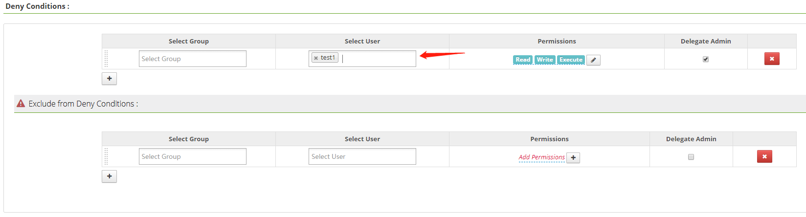

# HDFS配置Ranger

HDFS 作为底层存储，本章节将以 HDFS 为例，进行说明。

## 启用 HDFS-Ranger 插件

#### 1. 登陆NameNode所在集群节点并完成下述操作

首先需要分别在两台 NameNode 节点上开启 HDFS Ranger 插件，并重启集群，命令如下：

~~~shell
/srv/udp/1.0.0.0/hdfs/ranger-hdfs-plugin/enable-hdfs-plugin.sh 
~~~

`注：可通过 USDP 控制台查看 HDFS 相关组件中，NameNode1、NameNode2 分别运行在集群的哪些节点上。`

此时会在当前节点的如下目录自动生成相关权限配置：

~~~xml
/srv/udp/1.0.0.0/hdfs/etc/hadoop/hdfs-site.xml
<property>
    <name>dfs.permissions.enabled</name>
    <value>true</value>
</property>
<property>
    <name>dfs.permissions</name>
    <value>true</value>
</property>
<property>
    <name>dfs.namenode.inode.attributes.provider.class</name>
    <value>org.apache.ranger.authorization.hadoop.RangerHdfsAuthorizer</value>
</property>
~~~

并自动在该目录下生成软链接：

~~~shell
/srv/udp/1.0.0.0/hdfs/share/hadoop/hdfs/lib
ranger-hdfs-plugin-impl -> /srv/udp/1.0.0.0/hdfs/ranger-hdfs-plugin/lib/ranger-hdfs-plugin-impl
ranger-hdfs-plugin-shim-1.2.0.jar -> /srv/udp/1.0.0.0/hdfs/ranger-hdfs-plugin/lib/ranger-hdfs-plugin-shim-1.2.0.jar
ranger-plugin-classloader-1.2.0.jar -> /srv/udp/1.0.0.0/hdfs/ranger-hdfs-plugin/lib/ranger-plugin-classloader-1.2.0.jar
~~~

``注意：此时，需要通过 USDP 控制台重启两个NameNode，参见1.1.2节``

#### 2. 在USDP控制台完成两个NameNode服务重启

进入左侧导航栏 “服务管理”-“存储类”-“HDFS” 中，点击 “组件管理”，寻找到 “NameNode1”、“NameNode2” 组件后，点击 “NameNode1”、“NameNode2” 组件对应的 “操作” 栏 <kbd>重启</kbd> 按钮。


## 配置权限

#### 1. 访问 Ranger Web UI 页面

请在云端内网环境中使用浏览器访问 Ranger Web UI页面。

#### 2. 添加 HDFS-Service

在Service Manager页面的 HDFS 条目中，点击  <kbd>+</kbd> 按钮进行创建 Service，如下图所示：


进入Create Service服务配置页面，在 Service Name 输入框中填入如下值：

~~~shell
ranger-hdfs-service
~~~

`注意: 此处必须填写此值！`


#### 3. 配置 HDFS-Service 用户名密码

填入用户名密码为如下：

~~~shell
Username：hadoop
Password：hadoop
~~~

#### 4. 配置 NameNode HA 参数

在 NameNode URL 中填入如下配置：

~~~shell
hdfs://usdp-xxx-master1:8020,hdfs://usdp-xxx-master2:8020
~~~

`注意：请替换示例中主机名字符串中的“xxx”为正确的主机名字符串。`

填入规则如下图所示：



#### 5. 配置代理参数

在下方 Add New Configuration 中配置代理参数如下：

~~~shell
policy.download.auth.users: hadoop
~~~

配置完成后如下图所示：



然后点击 <kbd>Test Connection</kbd> 按钮，如果得到如下图所示样例，则表示成功。


最后，点击 <kbd>Add</kbd> 按钮，此时Ranger Web UI的Service Manager页面显示如下：



## 添加测试用户

#### 1. 添加用户

在 Ranger Web UI 中，点击顶部导航栏 “Settings” 菜单，选择“Users”标签页，点击页面右侧的 <kbd>Add New User</kbd> 添加测试用户，如下图所示：


编辑内容，完成后点击 <kbd>Save</kbd> 按钮保存，如下图所示：



``注：Select Role 中，选择 User 类型，而非 Admin 类型。``

#### 2. 在 Linux 中添加用户

通过 ssh 在集群节点上，添加与上述配置相同的用户test1，命令如下：

~~~shell
useradd test1
~~~

#### 3.  验证用户当前权限

使用如下命令，验证刚添加的 test1 用户是否拥有对应权限：

~~~shell
su -s /bin/bash test1 -c "/srv/udp/1.0.0.0/hdfs/bin/hdfs dfs -ls /"
~~~

返回结果如下：

~~~shell
drwxrwxr-x   - hadoop supergroup          0 2020-11-06 11:28 /flink-completed-jobs
drwxr-xr-x   - hadoop supergroup          0 2020-11-06 11:30 /hbase
drwxr-xr-x   - hadoop supergroup          0 2020-11-06 11:29 /kylin
drwxrwxr-x   - hadoop supergroup          0 2020-11-06 11:28 /spark-logs
drwxr-xr-x   - hadoop supergroup          0 2020-11-06 11:27 /tez
drwxrwx---   - hadoop supergroup          0 2020-11-06 11:28 /tmp
drwxr-xr-x   - hadoop supergroup          0 2020-11-06 11:28 /user
~~~

此时证明 test1 用户对HDFS的根目录拥有访问权限。

## 编辑权限

接下来，以配置拒绝 test1 用户访问 HDFS 为例，进行示例说明。

#### 1. 进入编辑页面

如下图所示，进入HDFS条目的“ranger-hdfs-service”策略编辑页面：


#### 2. 删除默认规则

首先，删除Ranger默认的权限策略，如下图所示：


#### 3. 添加自定义规则

点击右上角的 <kbd>Add New Policy</kbd> 即可添加自定义权限策略规则，如下图所示：



#### 4. 配置 Policy Details

在 Policy Name 属性中，建议键入比较有标识度的规则名称，例如：deny_test1_all，即，拒绝 test1 用户所有对 HDFS 的操作。

同时，在 Resource Path 中输入HDFS的根目录：/  并键入回车，同时，要确保 recursive 滑块处于开启状态。

最终配置信息，如下图所示：



#### 5. 配置权限类型

配置权限可以分为两种类别：允许的权限、拒绝的权限。

本例中，以配置拒绝的权限为例进行说明，即拒绝 test1 用户对 HDFS 根目录及其子目录下的所有操作。参考如下 “配置拒绝权限” 所示进行配置操作。

* 配置允许的权限，如下图所示：

  

* 配置拒绝的权限，如下图所示：

  

#### 6. 查看配置完成的权限

完成上述配置项填写后，点击 <kbd>Add</kbd> 按钮保存，即已完成添加自定义策略配置，并回到权限策略概览页面，如下图所示：


``注：权限添加后，大约需要 1 分钟左右即会生效。``

## 验证权限配置

接下来，通过 ssh 访问集群中安装了 HDFS 服务组件的“任意”节点，进行 shell 操作来验证权限是否生效。

试验命令如下：

~~~shell
su -s /bin/bash test1 -c "/srv/udp/1.0.0.0/hdfs/bin/hdfs dfs -ls /"
~~~

若返回如下信息，说明当前节点本地无“test1”用户

```shell
su: user test2 does not exist
```

参见1.3.2节，执行 “useradd test1”添加test1用户后再重试上述命令，返回结果如下：

~~~shell
ls: Permission denied: user=test1, access=EXECUTE, inode="/"
~~~

此时证明权限配置已生效，test1用户已无权访问HDFS的任何目录了。
