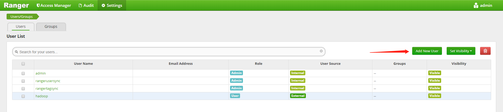
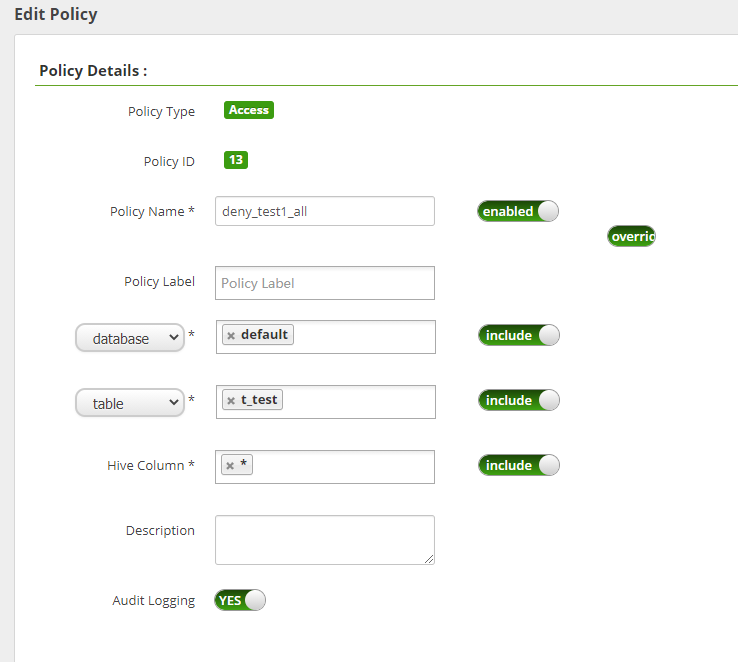

# Hive配置Ranger

## 启用 Hive-Ranger 插件

#### 1. 登陆 HiveServer2 所在集群节点并完成下述操作

首先需要在 HiveServer2 所在节点上开启 Hive Ranger 插件，并重启集群，命令如下：

~~~shell
/srv/udp/1.0.0.0/hive/ranger-hive-plugin/enable-hive-plugin.sh 
~~~

`注：可通过 USDP 控制台查看 Hive 相关组件中，HiveServer2 运行在集群的哪个节点上。`

此时会在当前节点的 Hive 配置文件目录中自动变更如下配置文件：

~~~shell
ll /srv/udp/1.0.0.0/hive/conf

hiveserver2-site.xml
ranger-hive-audit.xml
ranger-hive-security.xml
ranger-policymgr-ssl.xml
ranger-security.xml
~~~

``注意：此时，需要通过 USDP 控制台重启 HiveServer2``

#### 2. 在USDP控制台完成 HiveServer2 服务重启

进入左侧导航栏 “服务管理”-“计算类”-“HIVE” 中，点击 “组件管理”，寻找到 “HiveServer2” 组件后，点击 HiveServer2 组件对应的 “操作” 栏 <kbd>重启</kbd> 按钮。

## 配置权限

#### 1. 访问 Ranger Web UI 页面

请在云端内网环境中使用浏览器访问 Ranger Web UI页面。

#### 2. 添加 Hive-Service

在 Hive 条目中，点击 <kbd>+</kbd> 按钮进行创建 Service，如下图所示：

并在 Service Name 输入框中填入如下值：（注意，此处必须为此值）

~~~shell
ranger-hive-service
~~~

`注意: 此处必须填写此值！`

#### 3. 设置 Hive-Service 用户名密码

设置用户名密码如下：

~~~shell
Username：hadoop
Password：hadoop
~~~

#### 4. 配置 JDBC 驱动类

设置 `jdbc.driverClassName` 属性值为：org.apache.hive.jdbc.HiveDriver

#### 5. 配置 JDBC URL

此处设置 HiveServer2 的连接即可，配置举例如下：

~~~shell
jdbc:hive2://10.9.136.30:10000
~~~

`注意：该示例中的 IP 地址为 HiveServer2 所在节点的内网 IP。`

#### 6. 配置代理参数

在下方 <kbd>Add New Configuration</kbd> 中配置代理参数如下：

~~~shell
policy.download.auth.users: hadoop
~~~

配置完成后如下图所示：

然后点击 <kbd>Test Connection</kbd> 按钮，如果得到如下图所示样例，则表示成功。

最后，点击 <kbd>Add</kbd> 按钮即可。

## 添加测试用户

#### 1. 添加用户

在 Ranger Web UI 中，点击顶部导航栏 “Settings” 菜单，选择“Users”标签页，点击页面右侧的 <kbd>Add New User</kbd> 添加测试用户，如下图所示：

编辑内容如下图所示：

``注：Select Role 中，选择 User 类型，而非 Admin 类型。``

#### 2. 在 Linux 中添加用户

通过 ssh 在集群节点上，需要添加与上述配置相同的用户，命令如下：

~~~shell
useradd test1
~~~

#### 3. 验证用户当前权限

使用如下命令，验证 test1 用户拥有对应权限：

~~~shell
/srv/udp/1.0.0.0/hive/bin/beeline -u jdbc:hive2://10.9.136.30:10000 -n test1
~~~

然后再 beeline 命令行输入：

~~~shell
0: jdbc:hive2://10.9.136.30:10000> create table t_test(a string);
~~~

结果如下：

~~~shell
0: jdbc:hive2://10.9.136.30:10000> show tables;
+-----------+
| tab_name  |
+-----------+
| t_test    |
+-----------+
~~~

此时证明 test1 有对表操作的权限。

## 编辑权限

#### 1. 进入编辑页面

如下图所示，即可进入编辑页面：

#### 2. 删除默认规则

如下图所示：

#### 3. 添加自定义规则

点击右上角的 <kbd>Add New Policy</kbd> 按钮添加默认规则，如下图所示：

#### 4. 配置 Policy Details

在 Policy Name 属性中，建议键入比较有标识度的规则名称，例如：deny_test1_all，即，拒绝 test1 用户所有对 HDFS 的操作。

同时，在 Resource Path 中输入：/，并键入回车，同时，要确保 recursive 开关开启。

最终配置如下图所示：

#### 5. 配置权限类型

配置权限可以分为两种类别：允许的权限、拒绝的权限。本例中，以配置拒绝的权限为例进行说明，即，拒绝 test1 用户对 HDFS 根目录及其子目录下的所有操作。如下 “配置拒绝权限” 所示。

* 配置允许的权限

  

* 配置拒绝的权限

  

#### 6. 查看配置完成的权限

上述配置完成后，点击 <kbd>Add</kbd> 按钮完成添加，并回到权限概览页面，如下图所示：

``注：权限添加后，大约需要 1 分钟即可生效。``

### 验证权限配置

在 Linux 中，使用如下命令，验证 test1 用户拥有对应权限：

~~~shell
/srv/udp/1.0.0.0/hive/bin/beeline -u jdbc:hive2://10.9.136.30:10000 -n test1
~~~

然后再 beeline 命令行输入：

~~~shell
0: jdbc:hive2://10.9.136.30:10000> insert into t_test values('nick');
~~~

结果如下：

~~~shell
Error: Error while compiling statement: FAILED: HiveAccessControlException Permission denied: user [test1] does not have [UPDATE] privilege on [default/t_test] (state=42000,code=40000)
~~~

此时证明 test1 已经失去对 t_test 表的操作权限，更多细粒度的控制，可以在上述 2.4.5 中进行配置。