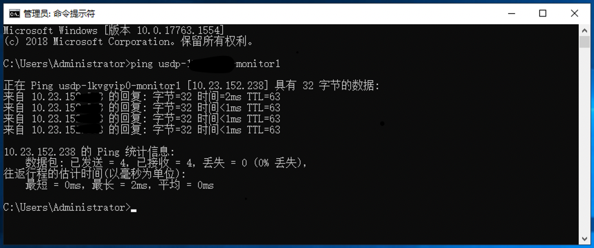
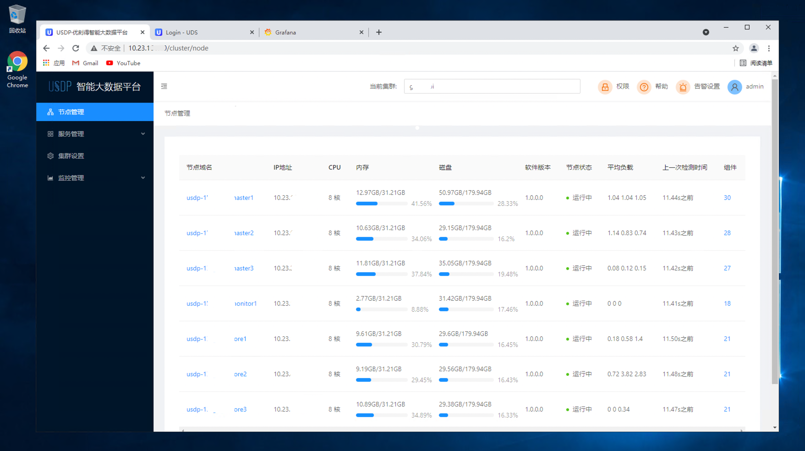
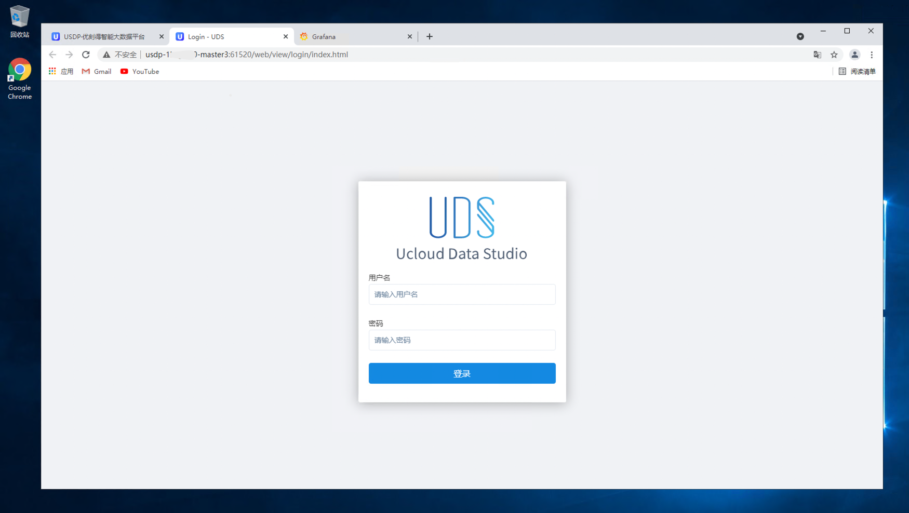
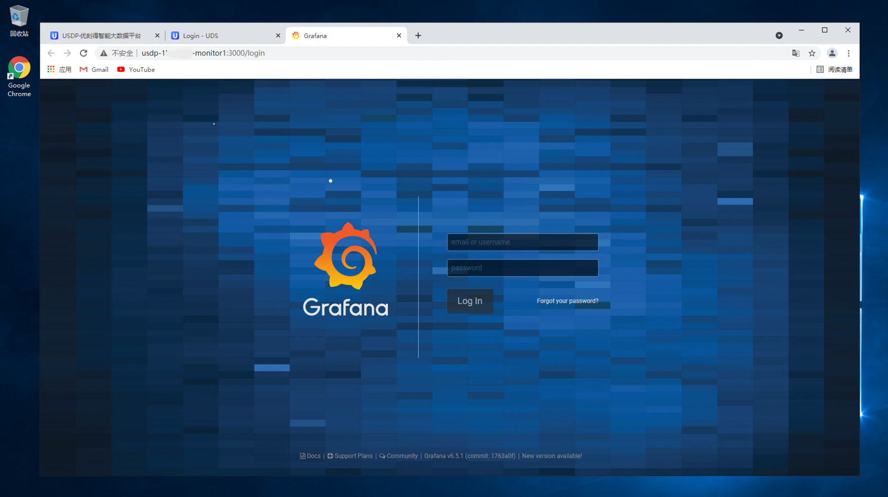

# 通过云端Windows主机访问USDP集群

#### 配置方式概述：

​		该方式，是通过在云端借用Windows主机，并通过内网来访问USDP集群，需为Windows云主机单独绑定1个 [EIP](https://docs.ucloud.cn/unet/eip/guide?id=%e7%94%b3%e8%af%b7%e5%bc%b9%e6%80%a7ip) ，结合云端主机 [防火墙](https://docs.ucloud.cn/unet/firewall/guide) 策略对Windows云主机实现访问限制和保护，用户本地直接使用远程桌面连接工具访问云端资源。

​		该方式配置略复杂，管理较为便利，有助于提升云端环境的安全性，但大数据研发、运营人员可能不够灵活。适用于操作及访问大数据集群的人数较少、频率较低等情况。

#### 工具及辅助产品：

1. 本地PC远程连接云端Windows主机桌面。
2. 使用云端Windows主机的Chrome浏览器内网访问USDP管理控制台。

#### 动手配置：

**Step1：**创建Windows云主机

​		参见 [选购一台uhost主机](https://docs.ucloud.cn/uhost/newuser/briefguide) ，在云端创建一台Windows操作系统的云主机。

?> **注意：** - 云主机操作系统选择Windows。 - 按照创建流程，为该主机绑定1个EIP。 - 为该云主机绑定“非Web服务器推荐(22，3389)”防火墙。 - 需保证Windows云主机与USDP集群内网可以互通（可借助VPC及安全组等策略进行调整）。

**Step2：**远程桌面连接到Windows云主机

?> **PC端操作系统差异** windows操作系统可直接使用系统再带的“远程桌面连接”工具。 Mac或其他PC设备可使用一些远程桌面连接工具。

**Step3：**为Windows云主机做适当配置修改

- 为Windows云主机安装Chrome浏览器。

- 更改云主机的hosts配置文件

  hosts文件存储位置参考：c:\windows\system32\drivers\etc

  打开hosts文件后，末尾追加如下（样例）内容。

  ~~~shell
  # USDP Test Cluster
  10.23.xxx.xxx	usdp-1******-master1
  10.23.xxx.xxx	usdp-1******-master2
  10.23.xxx.xxx	usdp-1******-master3
  10.23.xxx.xxx	usdp-1******-monitor1
  10.23.xxx.xxx	usdp-1******-core1
  10.23.xxx.xxx	usdp-1******-core2
  10.23.xxx.xxx	usdp-1******-core3
  ~~~

  ?> **如上样例所示：**左侧为USDP各个节点默认的 **内网IP** 地址，右侧为对应节点的“完全限定域名”（主机名）。

#### 效果验证：

**Step4：**ping测试USDP集群各个节点的“完全限定域名”（主机名）。

**Step5：**在本地PC浏览器中直接打开USDP管理控制台

~~~URL
http://<your_master1_ip>
~~~

或输入Master1节点的内网IP地址。

**Step6：**访问分布在各节点上的其他大数据服务WebUIs

~~~URL
http://usdp-1******-monitor1:3000
~~~

如上示例URL，即会打开USDP大数据集群的监控查看页面Grafana。

或者可以在USDP管理控制台中，主动查看集群已安装的各个大数据服务的WebUIs；参见：[ 服务Web UIs便捷访问](/USDP/operate/service/compute_kind?id=yarn-服务web-uis便捷访问) 。

