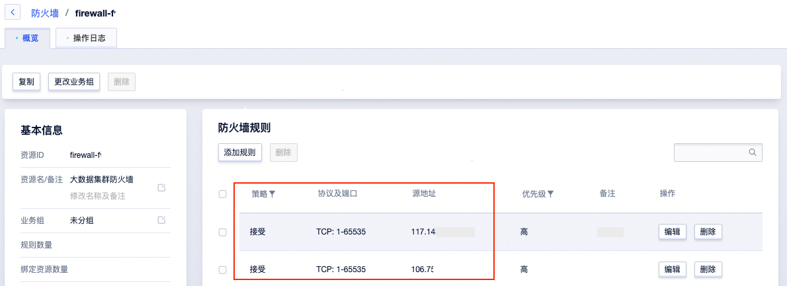
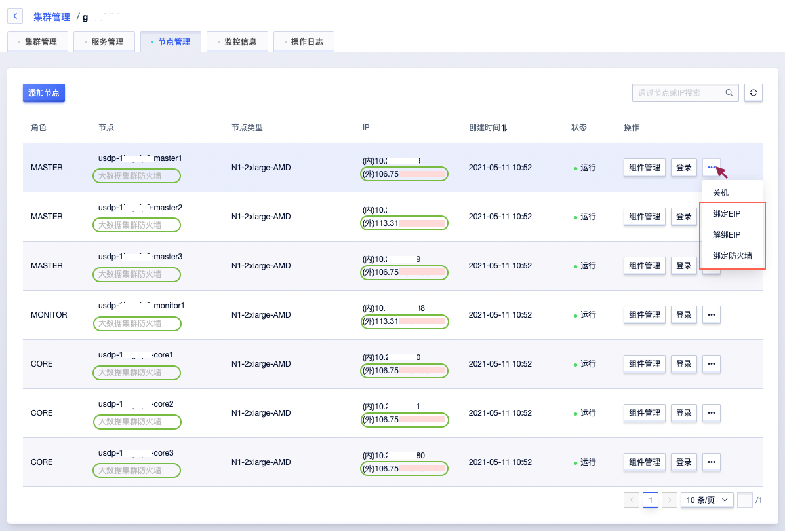

# 本地直接访问云端USDP集群

### 配置方式概述：

该方式，是为USDP的各个节点，单独绑定 EIP ，结合云端防火墙策略对USDP各节点实现访问限制和保护，并直接通过用户本地PC浏览器来访问USDP管理控制台。

该方式配置相对简单，适用于集群规模较小，或服务测试等临时情况，该方式的缺点是，需为集群的各个节点单独绑定EIP地址，会增加用户云端管理员维护复杂度。

### 工具及辅助产品：

1. 本地PC的hosts更改；

   USDP通过“完全限定域名”并在本地解析需要访问的目的IP地址的。

2. 需N个 [EIP](https://docs.ucloud.cn/unet/eip/guide?id=%e7%94%b3%e8%af%b7%e5%bc%b9%e6%80%a7ip)；

   可根据实际需要调整。

3. 云端 [防火墙](https://docs.ucloud.cn/unet/firewall/guide) 策略；

### 动手配置：

**Step1：**创建或更新云端防火墙策略

--------

参见 [防火墙操作指南](https://docs.ucloud.cn/unet/firewall/guide) ，为云端USDP环境各节点准备防火墙及规则备用。

?> **如上图所示：** - 防火墙规则中，协议及端口，用户可根据实际需要进行灵活调整。 - 建议通过添加源地址，达到将互联网中无关IP来源的请求过滤掉的目的，使此方式访问集群更安全。

**Step2：**[创建EIP](https://docs.ucloud.cn/unet/eip/guide?id=%e7%94%b3%e8%af%b7%e5%bc%b9%e6%80%a7ip)，并在USDP <kbd>集群管理</kbd> - <kbd>节点管理</kbd> 中，为集群各节点绑定EIP；

参见[在公有云端usdp集群资源节点管理](/USDP/operate/node/README?id=在公有云端usdp集群资源节点管理) 。

**Step3：**配置本地PC的hosts文件

如前面的图片所示，此时，源地址端的PC本地hosts文件末尾追加如下（样例）内容。

~~~shell
# USDP Test Cluster
106.75.xxx.xxx	usdp-1******-master1
113.31.xxx.xxx	usdp-1******-master2
106.75.xxx.xxx	usdp-1******-master3
113.31.xxx.xxx	usdp-1******-monitor1
106.75.xxx.xxx	usdp-1******-core1
106.75.xxx.xxx	usdp-1******-core2
106.75.xxx.xxx	usdp-1******-core3
~~~

?> **如上样例所示：**左侧为USDP各个节点已 **绑定的EIP** 地址，右侧为对应节点的“完全限定域名”（主机名）。

### 效果验证：

**Step4：**在本地PC浏览器中直接打开USDP管理控制台

~~~URL
http://<your_master1_ip>
~~~

或输入Master1节点的“完全限定域名”；

或在已创建的USDP集群条目右侧，点击 <kbd>访问USDP</kbd> 按钮，进入USDP自有管理控制台。

**Step5：**访问分布在各节点上的其他大数据服务WebUIs

~~~URL
http://usdp-1******-monitor1:3000
~~~

如上示例URL，即会打开USDP大数据集群的监控查看页面Grafana。

或者可以在USDP管理控制台中，主动查看集群已安装的各个大数据服务的WebUIs；参见：[ 服务Web UIs便捷访问](/USDP/operate/service/compute_kind?id=yarn-服务web-uis便捷访问) 。

