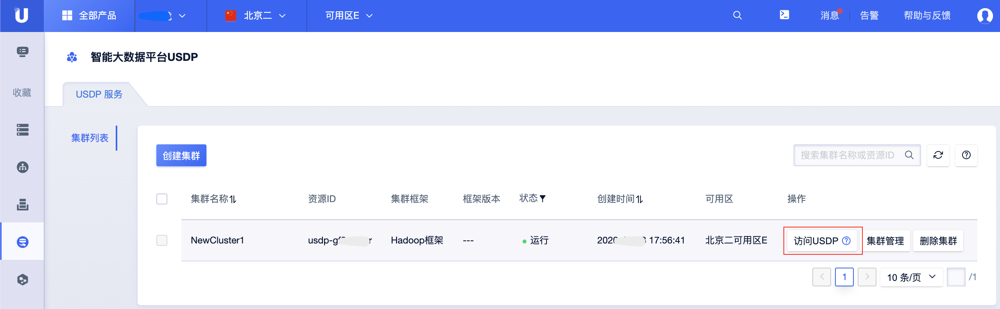

# 告警管理

在智能大数据平台USDP中，为便于用户快速获知集群相关健康状态，USDP提供较为友好的告警管理功能，譬如集群资源节点的系统级告警、大数据服务的基本告警配置、以及USDP提供的统一的告警模板管理等，辅助用户更好的管理和使用USDP。

**通过本篇指南，您可以了解到：**

- [公有云端资源节点告警设置](/USDP/operate/alarm/README?id=公有云端资源节点告警设置)
- [集群告警设置](/USDP/operate/alarm/README?id=集群告警设置)

## 公有云端资源节点告警设置

待补充

## 集群告警设置

- 在已创建的USDP集群条目右侧，点击 <kbd>访问USDP</kbd> 按钮，进入USDP自有管理控制台。

- 登陆USDP控制台

详尽的集群告警模板管理、通知方式管理、告警设置生效，均需在USDP控制台内完成，参考如下内容：

* [告警模板管理](/USDP/operate/alarm/alarm_template)
* [设置告警邮件发送服务](/USDP/operate/alarm/set_emailserver)
* [通知对象管理](/USDP/operate/alarm/notification_object)
* [通知组管理](/USDP/operate/alarm/notification_group)
* [告警设置](/USDP/operate/alarm/set_alarm)

关于USDP大数据集群告警相关的所有配置更改及管理，均可参考本篇指南完成。

