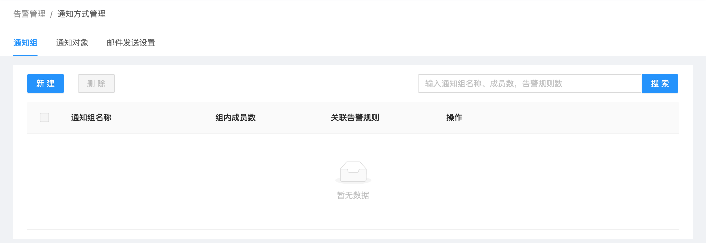
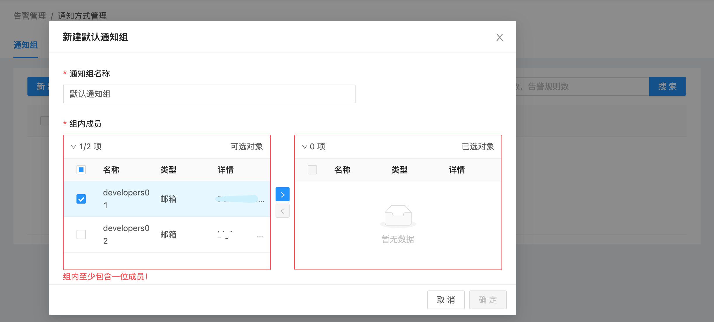
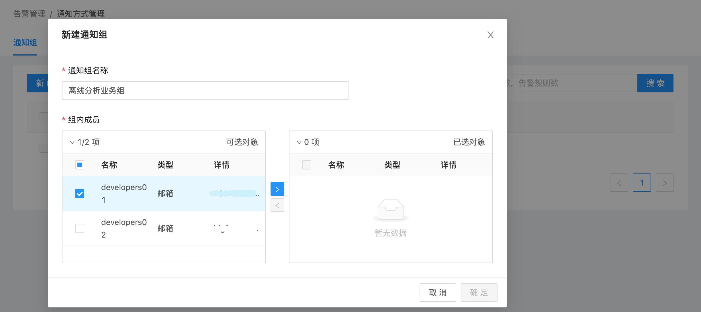
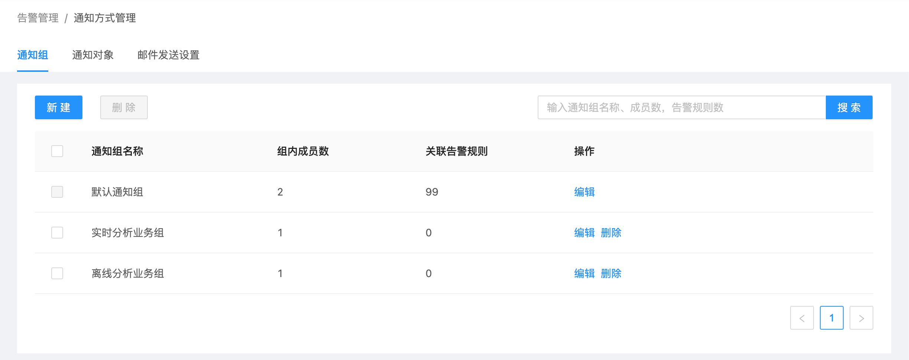

# 通知组管理

USDP支持通知组管理的能力，结合 [通知组](/USDP/operate/alarm/notification_group) 与 [告警模块](/USDP/operate/alarm/alarm_template) “监控指标”的绑定，实现监控规则触发时，即使将告警信息发送给绑定的通知组中的 [通知对象](/USDP/operate/alarm/notification_object)。

这里将介绍通知组的的管理和维护的方法。

**通过本篇指南，您可以了解到：**

- [进入通知组管理页面](/USDP/operate/alarm/notification_group?id=进入通知组管理页面)
- [添加通知组](/USDP/operate/alarm/notification_group?id=添加通知组)

## 进入通知组管理页面

登陆USDP控制台后，点击/鼠标滑至左上交 “橙色警报器” 图表位置，会自动展开下拉菜单项目，点击 通知方式管理 菜单项，进入 通知方式管理 页面，如下图所示：

进入 “通知方式管理” 页面时，点击 “通知组” 选项卡，如下图所示：

## 添加通知组

默认情况下，当首次执行 “通知组”-“新建” 时，USDP要求必须先添加 “默认通知组”，通知组名称不可更改，勾选 “通知对象” 并点击 <kbd>></kbd> 按钮，再在对话框右下角点击 <kbd>确定</kbd> 按钮，即可完成。如下图所示：

!>“默认通知组”，一经创建，不得删除。 “默认通知组” 中的 “通知对象”，可以灵活调整，但不得少于一个 “通知对象”。 每个“通知组”（含默认通知组）中，至少需要保留一个 “通知对象”。

再次操作 “通知组”-“新建” 时，用户可灵活定义 “通知组名称”，勾选 “通知对象” 并点击 <kbd>></kbd> 按钮，再在对话框右下角点击 <kbd>确定</kbd> 按钮，即可完成。如下图所示：

添加好 “通知组” 后，如下图所示：

在此，用户可对已添加的通知组实行管理操作，例如 “删除” 某个通知组，“编辑”通知组等。