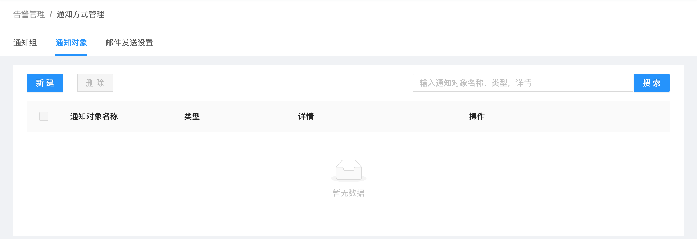
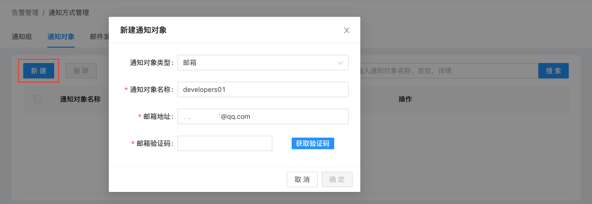
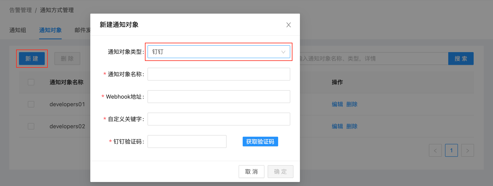
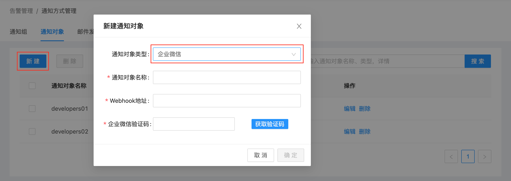
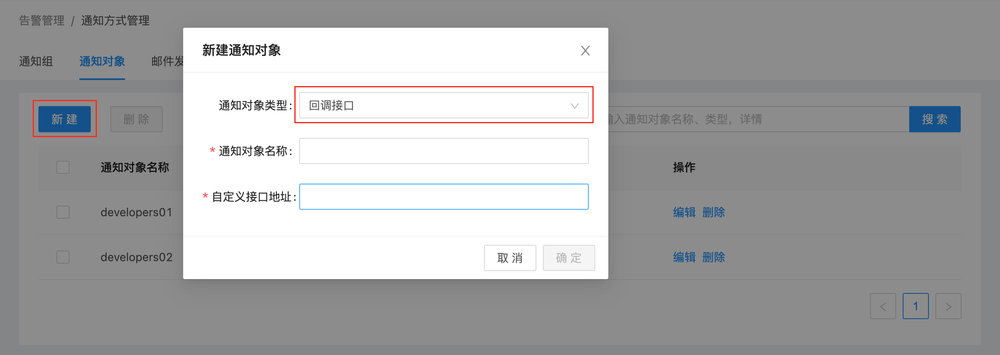
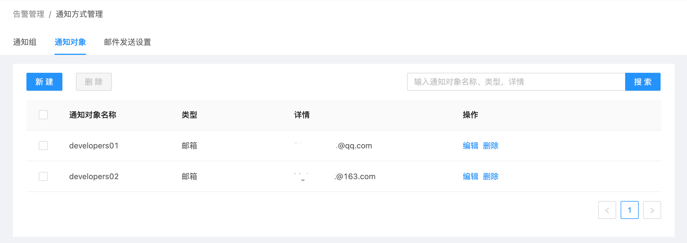
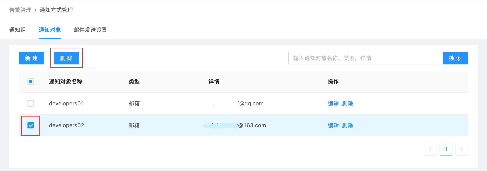

# 通知对象管理

通知对象，是USDP系统中，告警信息发送的目标用户，通知对象是由 [通知组](/USDP/operate/alarm/notification_group) 进行管理的；通知组再与 [告警模板](/USDP/operate/alarm/alarm_template) 中的监控指标关联。

USDP支持多种通知对象类型，提供对各类通知对象的管理和维护方法。

?>当前，USDP支持的通知对象类型有： 邮箱 钉钉 企业微信 回调接口

**通过本篇指南，您可以了解到：**

- [进入通知对象管理页面](/USDP/operate/alarm/notification_object?id=进入通知对象管理页面)
- [添加通知对象](/USDP/operate/alarm/notification_object?id=添加通知对象)
  - [新建邮箱类型的通知对象](/USDP/operate/alarm/notification_object?id=新建邮箱类型的通知对象)
  - [新建钉钉类型的通知对象](/USDP/operate/alarm/notification_object?id=新建钉钉类型的通知对象)
  - [新建企业微信类型的通知对象](/USDP/operate/alarm/notification_object?id=新建企业微信类型的通知对象)
  - [新建回调接口类型的通知对象](/USDP/operate/alarm/notification_object?id=新建回调接口类型的通知对象)
- [管理已有通知对象](/USDP/operate/alarm/notification_object?id=管理已有通知对象)

## 进入通知对象管理页面

登陆USDP控制台后，点击/鼠标滑至左上交 “橙色警报器” 图表位置，会自动展开下拉菜单项目，点击 <kbd>通知方式管理</kbd> 菜单项，进入 通知方式管理 页面，如下图所示：

进入 “通知方式管理” 页面时，点击 “通知对象” 选项卡，如下图所示：

## 添加通知对象

新建 “通知对象” 时，选择相应的 “通知对象类型”，并按要求填入其余信息，即可完成 “通知对象” 添加的操作。

### 新建邮箱类型的通知对象

在 “通知对象” 标签页，点击左上角 <kbd>新建</kbd> 按钮，在弹出的 “新建通知对象” 对方框中 “通知对象类型” 处，选择 “邮箱”，如下图所示：

“通知对象名称”，填写该对象的名称等信息；并输入此人 “邮箱地址” 后，点击 <kbd>获取验证码</kbd> 按钮，此时该邮箱即收到一条验证邮件，内容中包含“验证码” 等信息，索要 “验证码” 后填入，点击 <kbd>确定</kbd> 按钮完成添加操作。

### 新建钉钉类型的通知对象

在 “通知对象” 标签页，点击左上角 <kbd>新建</kbd> 按钮，在弹出的 “新建通知对象” 对方框中 “通知对象类型” 处，选择 “钉钉”，如下图所示：

通知对象名称，填写该对象的名称等信息；并输入钉钉的 “Webhook地址”，及 “自定义关键字” 后，点击 <kbd>获取验证码</kbd> 按钮，此时该钉钉即收到一条验证信息，内容中包含“验证码” 等信息，索要 “验证码” 后填入，点击 <kbd>确定</kbd> 按钮完成添加操作。

### 新建企业微信类型的通知对象

在 “通知对象” 标签页，点击左上角 <kbd>新建</kbd> 按钮，在弹出的 “新建通知对象” 对方框中 “通知对象类型” 处，选择 “企业微信”，如下图所示：

通知对象名称，填写该对象的名称等信息；并输入企业微信的 “Webhook地址” 后，点击 <kbd>获取验证码</kbd> 按钮，此时该企业微信即收到一条验证信息，内容中包含“验证码” 等信息，索要 “验证码” 后填入，点击 <kbd>确定</kbd> 按钮完成添加操作。

### 新建回调接口类型的通知对象

在 “通知对象” 标签页，点击左上角 <kbd>新建</kbd> 按钮，在弹出的 “新建通知对象” 对方框中 “通知对象类型” 处，选择 “回调接口”，如下图所示：

通知对象名称，填写该对象的名称等信息；并输入 “自定义接口的地址”，点击 <kbd>确定</kbd> 按钮完成添加操作。

## 管理已有通知对象

完成新建通知对象后，页面显示已添加后的所有 “通知对象”，如下图所示：

若因某通知对象工作变动原因，管理员可能需要删除该通知对象是；此时，勾选该对象左侧的复选框，并点击 <kbd>删除</kbd> 按钮完成，并确认后，完成删除操作，如下图所示：

