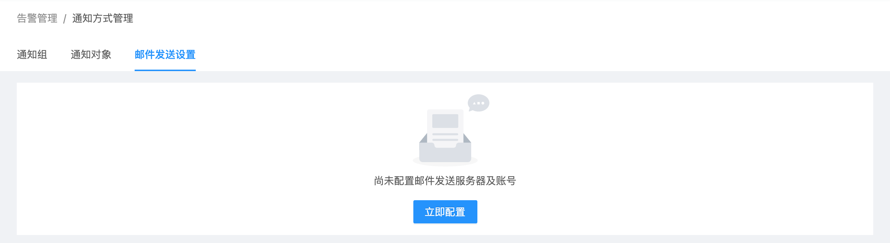
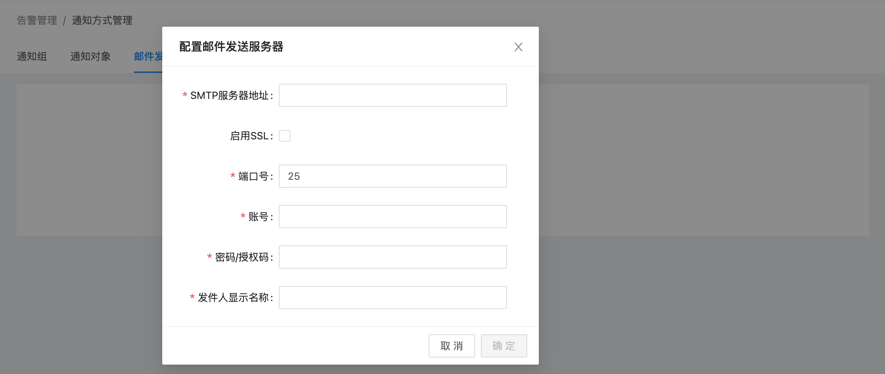
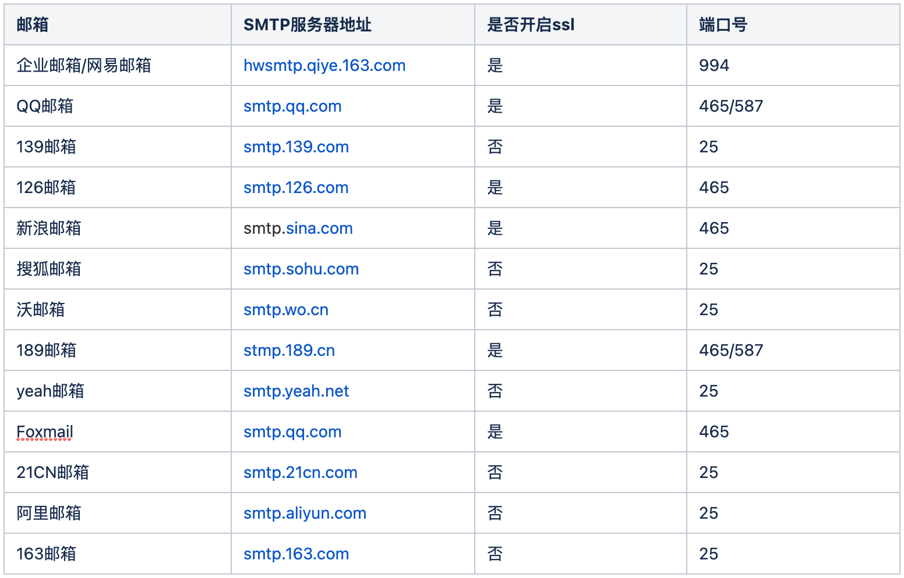
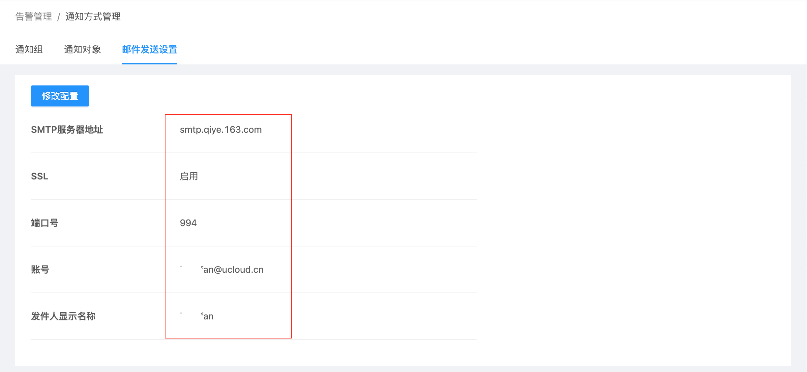

# 设置告警邮件发送服务

USDP管理服务是每个用户独享的，因此在使用邮件接收集群相关监控告警信息前，用户需要为USDP管理服务配置邮件发送服务器及账号等操作，通过本指南的内容，指引用户完成相关配置。

## 开始配置邮件发送服务

- 登陆USDP控制台后，点击/鼠标滑至左上交 “橙色警报器” 图表位置，会自动展开下拉菜单项目，点击 <kbd>通知方式管理</kbd> 菜单项，进入 通知方式管理 页面，如下图所示：

- 进入 “通知方式管理” 页面时，点击 “邮件发送设置” 选项卡，系统提示 “尚未配置邮件发送服务器及账号”，如下图所示：

!> USDP管理服务即为用户独享，且USDP管理服务默认是部署在集群Master1节点上，因此，需要为该集群Master1节点配置EIP，否则将服务配置及发送告警邮件。添加 EIP及防火配置，可前往 [绑定EIP、设置防火墙](/USDP/operate/node/cloud_node?id=绑定eip、设置防火墙) 参考。

- 点击 <kbd>立即配置</kbd> 按钮，在弹出的 “配置邮件发送服务器” 对话框中来配置，如下图所示：

此时，用户可参考如下列表内容，选择合适的 “邮箱类型”、“SMTP服务器地址”、“是否开启SSL”、端口，来完成对话框配置填写：

- 验证通过后，显示如下（这里是以UCloud邮箱服务器配置为示例）：

若需变更，可参考上图，点击 <kbd>修改配置</kbd> 按钮，在对话框中完成邮箱服务器及账号的变更操作。

至此，告警邮件发送服务的配置即已完成。