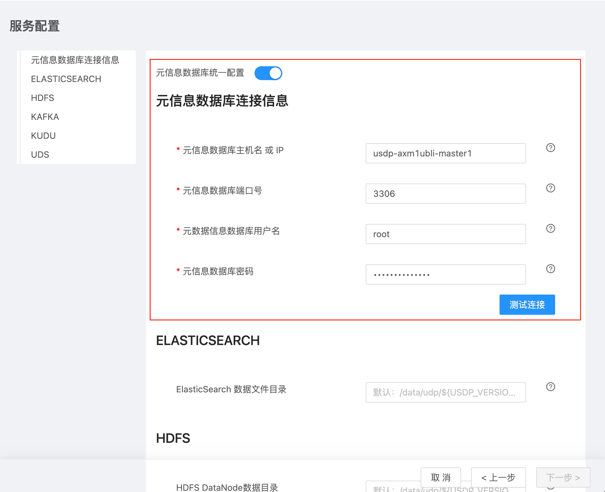
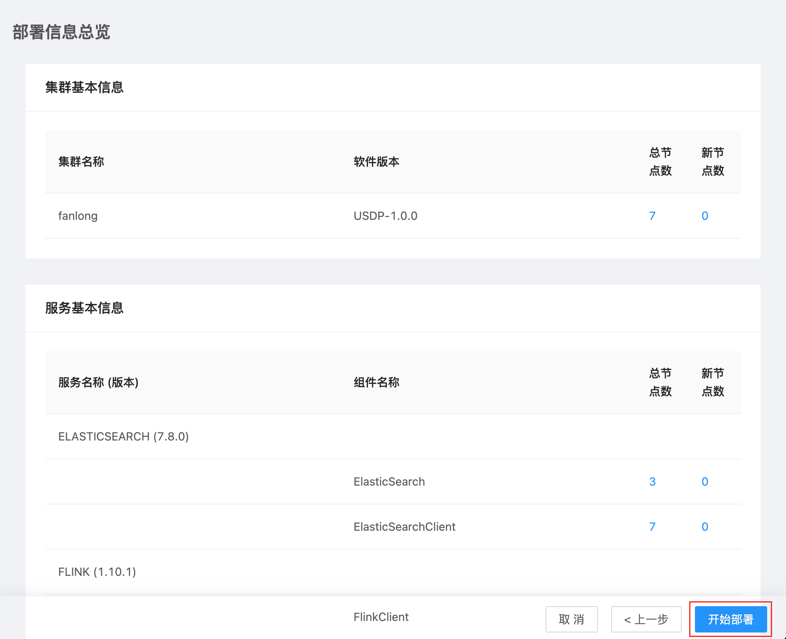

# 集群创建

智能大数据平台USDP集群的创建过程，分为两个部分，即在公有云控制台中，创建USDP的集群资源，待创建完成后，进入您独享的USDP管理服务开始规划并创建大数据集群。

**通过本篇指南，您可以了解到：**

- [开始创建集群资源](/USDP/operate/cluster?id=开始创建集群资源)
- [开始部署集群服务和组件](/USDP/operate/cluster?id=开始部署集群服务和组件)

参考本篇指南，开始创建并部署您的首个USDP集群吧。

## 开始创建集群资源

登陆[UCloud云控制台](https://console.ucloud.cn/)。

### 1 进入产品页面

进入公有云控制台首页后，点击左上角“全部产品”，在“数据分析”类目中点击“智能大数据平台USDP”，进入USDP集群管理页面。

### 2 点击 <kbd>创建集群</kbd> 按钮开始创建USDP集群资源

### 3 设置地域和可用区信息

请根据您的需要，在创建集群向导中设置新集群所归属的地域及可用区信息。

### 4 集群和软件设置

在此模块需要您设置并完善新集群所属VPC和子网信息、集群名称填写、框架及版本信息。

?>集群名称也是高可用NameNode的Namespace名称，需要字母和数字的组合，首位必须是字母

###  5 节点设置

- **Master节点**

    管理节点，主要适合用于部署zookeeper、Journalnode、NameNode、Resourcemanager、Hmaster、Hive等管理服务，可视化组件如Hue、oozie也建议部署在Master节点上。

- **core节点**

    核心节点，适合用于存储数据（HDFS）与运行任务。建议部署datanode、nodemanager、regionserver等服务。

- **Task节点**

     适合用于补充计算资源，建议只部署Nodemanager

- **Monitor节点**

    适合用于部署AlterManager、Grafana、InfluxDB、NodeExporter、Prometheus、USDPMonitor等监控服务

### 6 访问设置

在此处填写该集群资源的所有节点root用户统一的密码。

### 7 等待集群部署

根据集群节点资源规模不同，可能需要的部署时间会有所差异，一般情况下，创建大约会在30分钟左右完成。如下图所示，状态为正在部署中。

当状态处于“运行”状态的时，即可点击 <kbd>访问USDP</kbd> 按钮，进入USDP管理页面进行集群服务规划及部署操作。

## 开始部署集群服务和组件

###  使用USDP管理控制台部署服务
在已创建的USDP集群条目右侧，点击 <kbd>访问USDP</kbd> 按钮，进入USDP自有管理控制台。

#### 1 进入登录页面登录到USDP管理控制台
首次登录需要设置admin用户名的登录密码。如下所示：

#### 2 添加服务和组件
在右上角“当前集群”右侧点击集群名称，点击选择"添加服务或组件"，开始部署集群服务。

#### 3 选择服务
USDP支持大数据生态服务较多，在集群安装时，用户根据业务需要，灵活选择所需安装的组件。

您可以在“服务组合方案”出从推荐方案A\B\C中进行选择，或“自定义”您需要的服务，其中“监控”服务是默认必须选择的，您无法取消。如下图所示：

#### 4 选择组件安装
大数据生态各服务，均由不同的组件构成，安装集群时，用户可根据业务需求规划，将不同的服务及组件分别都安装到集群的那些节点上。

若用户选择安装的服务较多或如上图中用户选择推荐方案A（全量部署方案），由于组件选项非常多，建议采用“智能推荐”的方式进行选择，或者在“智能推荐”的基础上进行修改。如下图所示：

> 以下，USDP建议，请您参考：  NameNode建议安装在usdp-xxx-masster的节点上，否则NameNode出现异常时，主从切换会失败。 节点名称为usdp-xxx-masster的节点，建议用于部署zookeeper、Journalnode、NameNode、Resourcemanager、Hmaster、Hive等服务和组件的master节点，可视化和调度组件如Hue、oozie、kibana、zkui也建议部署在Master节点上。 节点名称usdp-xxx-core核心节点，建议用于存储数据（HDFS）与运行任务。建议部署datanode、nodemanager、regionserver、presto work、impala。 节点名称usdp-xxx-task的节点，建议用于部署计算资源，建议用来部署Nodemanager、Client。 节点名称usdp-xxx-monitor的节点，建议用于部署AlterManager、Grafana、InfluxDB、NodeExporter、Prometheus、USDPMonitor等监控服务。

您也可根据您的需要，进行灵活规划并实时部署。

#### 5 服务配置
USDP默认将自身管理元信息、集群中大数据服务的相关元信息，统一配置至Master1节点的MySQL数据库中，默认开启“元信息数据库统一配置”、默认填充该MySQL的相关连接信息，点击 <kbd>测试连接</kbd> 按钮即可测试是否正常，如下图所示：

?> 元信息数据库配置涉及的服务有： HIVE、HUE、OOZIE、RANGER、UDS等五个服务。  MySQL版本：5.7.30

在此，请填写其他相关服务的配置信息，其中“ELASTICSEARCH”、“HDFS”、“KAFKA”、“KUDU”等相关数据存储目录信息。如下图所示：

“UDS”邮件服务器配置信息，可默认不填，并在集群安装完成后进入USDP控制台后，即可进入向导“下一步”。

##### 元信息数据库独立配置

若用户计划将“HIVE”、“HUE”、“OOZIE”、“RANGER”、“UDS”等服务的元信息数据库独立管理，此时，可点击取消 “元信息数据库统一配置” 右侧的滑块，同时，下方页面即会显示这些服务所需的数据库连接填写的表单，按要求填写，并分别点击下方的 <kbd>测试连接</kbd> 按钮，按钮变为绿色，即为测试连接成功。此后，即可进入向导下一步中。如下图所示：

#### 6 部署信息总览
至此，为您总览以上向导步骤中完成的所有选择及配置信息汇总展示，请确认无误后点击“开始部署”按钮开始集群的服务组件部署工作。如下图所示： 

#### 7 安装并启动服务
当服务安装发生错误时，您可以点击查看报错节点“失败”详情，参考详情提示信息，进行手动修复错误操作，之后点击“全部重试”按钮，重新进行服务组件部署工作。

部署过程中，各个节点正在进行的部署进展，均可通过进度条实时展示，可点击 “详情” 栏中的各个链接，查看当前进展详情，如下图所示：

点击对话框 - “安装任务栏” 的各个链接，几个查看其单个安装任务的执行日志，这将在安装过程中出错时变得很有用。如下图所示：

当安装过程中出现任务失败的情况，USDP会在左上角显示 <kbd>全部重试</kbd> 按钮，可点击重试安装。

待所有节点正常安装成功后，即可点击 <kbd>完成</kbd> 按钮，退出集群服务安装向导。此时新集群服务已安装完成。

其他更多操作，请参考本文档 “操作指南” 和 “开发指南” 相关章节文档内容。

