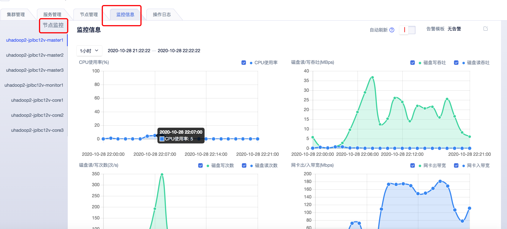

# 监控管理

## 公有云控制台USDP集群“监控管理”

在云控制台USDP集群详情 <kbd>监控信息</kbd> 标签页面中，仅支持对集群节点服务器相关的指标监控查看。

在此，您可选择查看不同节点的CPU、内存、磁盘、网络等相关监控指标图表，如下图所示。
    
``关于集群中各个服务的运行情况监控信息，请您前往“USDP管控控制台”后查看。``

如需查看USDP的各个集群的服务监控信息，请参考：[USDP的监控管理](http://usdp.cn-bj.ufileos.com/USDP%E7%94%A8%E6%88%B7%E6%89%8B%E5%86%8C-%E7%9B%91%E6%8E%A7%E7%AE%A1%E7%90%86.pdf)

