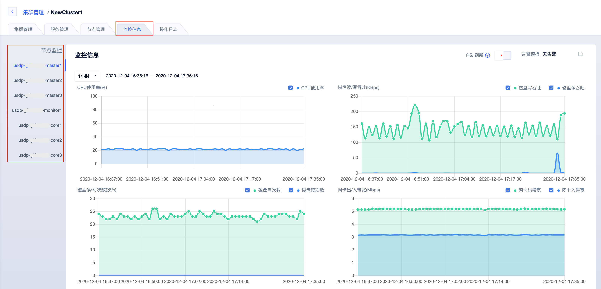

# 集群基础监控

集群基础监控信息及图表，可通过以下两种途径查看。

- [在公有云端USDP集群“监控管理”](/USDP/operate/monitor/basic_monitor?id=在公有云端USDP集群"监控管理")
- [在USDP控制台查看集群节点监控信息](/USDP/operate/monitor/basic_monitor?id=在USDP控制台查看集群节点监控信息)

## 在公有云端USDP集群“监控管理”

在集群管理详情 <kbd>监控信息</kbd> 选项卡后，即可查看针对当前集群的所有云端节点资源的指标监控。

### 对单台资源节点丰富的指标项监控

> CPU使用率(%)
>
> 内存使用率(%)
>
> 网卡出/入带宽(Mbps)
>
> 网卡出/入包量(个/s)
>
> 系统盘使用率(%)
>
> 数据盘使用率(%)
>
> 系统盘磁盘io使用率(%)
>
> 数据盘磁盘io使用率(%)
>
> 磁盘读/写吞吐(KBps)
>
> 磁盘读/写次数(次/s)
>
> 运行进程数(个)
>
> 阻塞进程数(个)
>
> 只读磁盘数量(个)
>
> 进程总数(个)
>
> TCP连接数(个)
>
> LoadAverage
>
> 探活节点个数(个)

### 对各资源节点的监控信息查看

可在上图所示页面左侧，点击不同节点的 “节点域名”，来切换查看各资源节点的详细监控指标图标。

## 在USDP控制台查看集群节点监控信息

可前往 USDP控制台集群节点管理 - [集群单节点管理](/USDP/operate/node/usdp_node?id=集群单节点管理) 参考查看。

