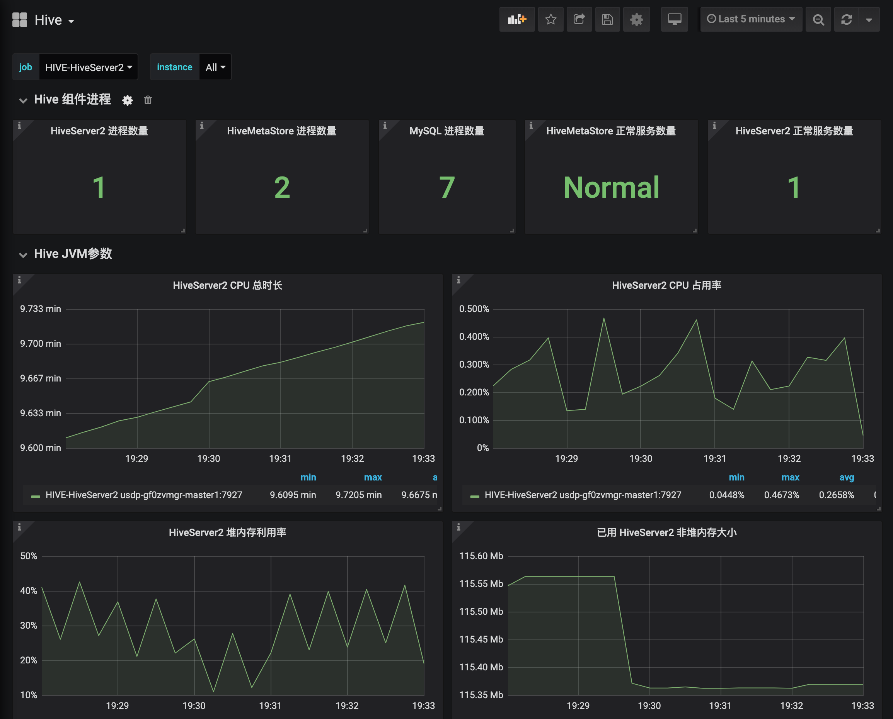

# 集群服务监控

USDP提供丰富的服务监控能力，对集群中各服务实现统一的监控数据采集，并通过Grafana统一管理和展示给使用用户，便于集群管理及开发者，对集群监控状况进行维护。

- [集群服务监控-监控图表](/USDP/operate/monitor/service_monitor?id=集群服务监控-监控图表)
- [查看各服务的监控图表](/USDP/operate/monitor/service_monitor?id=查看各服务的监控图表)
  - [查看HDFS服务监控图表](/USDP/operate/monitor/service_monitor?id=查看HDFS服务监控图表)
  - [查看YARN服务监控图表](/USDP/operate/monitor/service_monitor?id=查看YARN服务监控图表)
  - [查看HIVE服务监控图表](/USDP/operate/monitor/service_monitor?id=查看HIVE服务监控图表)
  - [查看HBASE服务监控图表](/USDP/operate/monitor/service_monitor?id=查看HBASE服务监控图表)
  - [查看ZOOKEEPER服务监控图表](/USDP/operate/monitor/service_monitor?id=查看ZOOKEEPER服务监控图表)
  - [查看集群节点JVM监控图表](/USDP/operate/monitor/service_monitor?id=查看集群节点JVM监控图表)
- [查看更多其他服务监控图表](/USDP/operate/monitor/service_monitor?id=查看更多其他服务监控图表)

## 集群服务监控-监控图表

- 登陆USDP控制台。 参考 监控管理 -  [集群服务监控](/USDP/operate/monitor/README?id=集群服务监控) 登陆。
- 点击USDP控制台左侧导航栏 “监控管理” - “监控图表”，打开集群服务监控 Grafana 页面，并登陆。如下图所示：

!>默认登陆口令如下，请登陆后及时修改密码！ - 用户名：当前集群名称         - 密码：0okm9ijn)OKM(IJN

- 登陆后进入Grafana首页，如下图所示：

## 查看各服务的监控图表

在Grafana首页，点击左上角 <kbd>Home</kbd> 菜单栏按钮，打开下来菜单，选择您需要查看的集群服务名称，即可查看USDP已预置的对该服务的监控指标图表信息信息。如下所示：

### 查看HDFS服务监控图表

### 查看YARN服务监控图表

### 查看HIVE服务监控图表

### 查看HBASE服务监控图表

### 查看ZOOKEEPER服务监控图表

### 查看集群节点JVM监控图表

### 查看USDP管理服务监控图表

将USDP自身的集群管理服务也作为独立的监控图表，便于用户查看维护。

## 查看更多其他服务监控图表

更多其他服务的监控图表，均可在Grafana首页点击左上角 <kbd>Home</kbd> 菜单栏按钮，打开下来菜单，选择您需要查看的集群服务名称，即可查看。