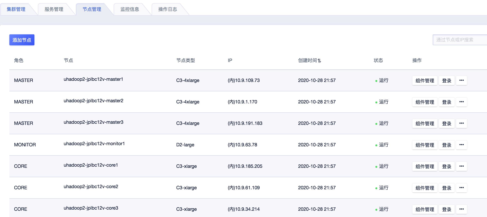
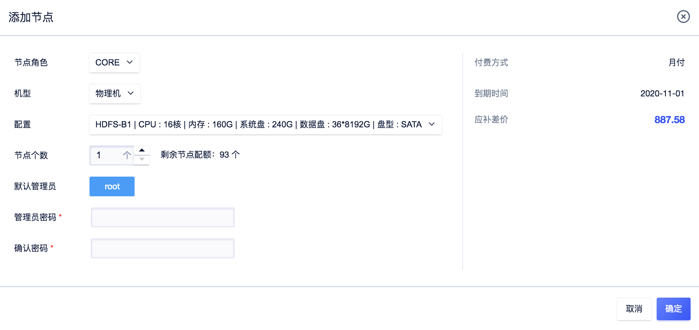
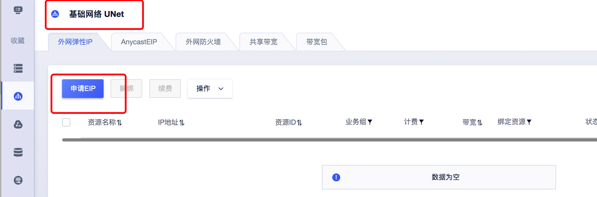
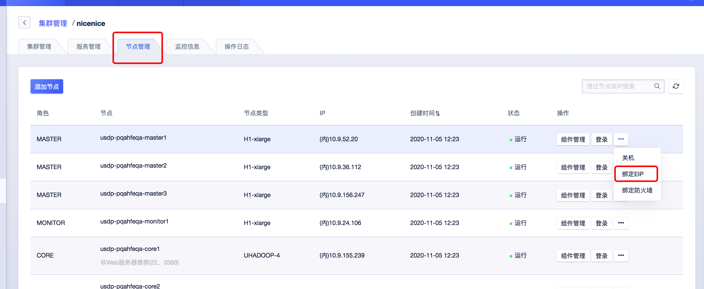

# 节点管理

## 获取节点列表

在集群管理详情页中，点击 <kbd>节点管理</kbd> 标签页后，即可查看当前集群的所有节点资源列表信息。

## 添加节点

点击 <kbd>添加节点</kbd> 按钮后弹窗如下，设置“节点角色”，“机型”、“节点个数”，此处支持批量创建同角色、同机型的多个节点；

待您输入新创建节点的初始密码后，点击 <kbd>确定</kbd> 按钮，等待节点创建。如下图所示：

## 删除节点

选中要删除的节点，点击 <kbd>删除</kbd> 按钮。

注意：
* 删除节点前，需要您先在“USDP管理控制台”中，对相应节点上的服务进行下线操作，待下线完成之后，才能在“节点管理”页面中完成删除节点。
* 目前暂不支持用户主动对主节点（master）、监控节点（monitor）的删除操作。

## 节点登录

**方式一：** 通过控制台登录。

``如果节点机型是物理机，那么由于不同服务器厂商标准不同，暂不能通过控制台登录集群。``

**方式二：** 给集群Master节点绑定外网EIP，您即可从本地通过外网ssh连接登录节点。

**方式三：** 通过云主机（UHost）内网ssh进行登录。例如您可在您的云主机上通过“ssh root@10.13.186.23 -p22”进行登录。 登录密码为集群创建时设置的密码。

``当需要通过云主机ssh登陆大数据集群节点时，请留意云主机与大数据集群的内网是否可达，如在同一VPC中，或不同VPC设置了VPC互通。``

## 绑定EIP、设置防火墙

1）首先需要在基础网络产品页面申请一个EIP，可参考[EIP操作指南](https://docs.ucloud.cn/unet/eip/guide)

2）然后到智能大数据平台USDP的节点管理进行绑定EIP操作。

`注意`绑定EIP之后，请配置好防火墙[防火墙操作指南](https://docs.ucloud.cn/unet/firewall/guide)，避免被入侵。

## 节点基本操作

支持对指定的节点进行 <kbd>关机</kbd> 、<kbd>开机</kbd> 、<kbd>重启</kbd> 、<kbd>删除</kbd> 等操作。请点击节点列表右侧具体节点操作栏中相关按钮，及 <kbd>...</kbd> 按钮展开操作菜单。

删除节点之前需要到USDP管理页面下线服务，否则会删除失败。

