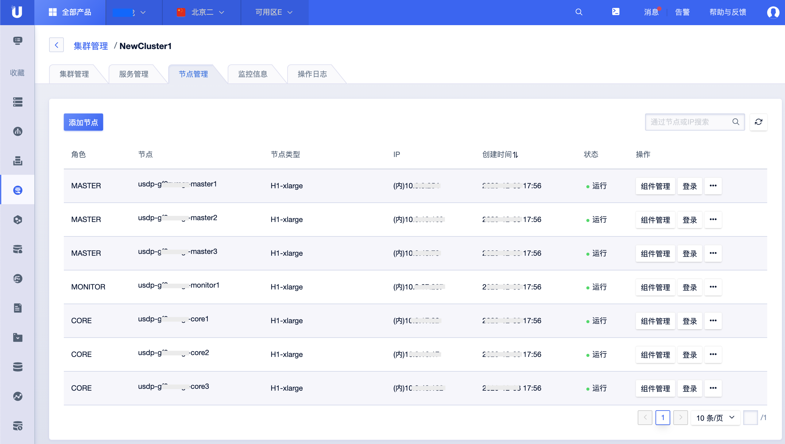
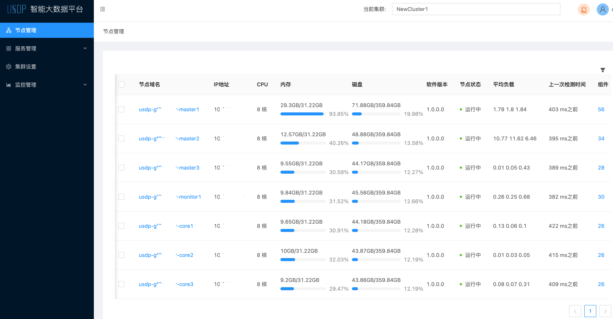

# 节点管理

USDP 大数据平台，在云端实现了两层管理能力，即公有云端的集群资源管理控制，和USDP自身控制台的管理控制。

## 在公有云端USDP集群资源“节点管理”

- 登陆[UCloud云控制台](https://console.ucloud.cn/)。

- 进入首页后，点击左上角“全部产品”，在“数据分析”类目中点击“智能大数据平台USDP”，进入USDP集群管理页面。

- 在已创建的USDP集群条目右侧，点击 <kbd>集群管理</kbd> 按钮，进入USDP集群管理页面，再点击 <kbd>节点管理</kbd> 选项卡后，即可查看当前集群的所有云端资源列表信息。

在此，可针对该集群的所有云端资源实现管理操作，如添加/删除节点、快捷登陆节点、给节点绑定公网EIP、给节点绑定防火墙、关机/启动节点等操作，点击下方链接前往查阅。

- [公有云端USDP集群资源节点管理详情](/USDP/operate/node/cloud_node)

## 在USDP控制台查看集群“节点管理”

- 在已创建的USDP集群条目右侧，点击 <kbd>访问USDP</kbd> 按钮，进入USDP自有管理控制台。

- 登陆USDP控制台

- 点击USDP控制台左侧导航菜单 <kbd>节点管理</kbd> ，即可查看当前集群的所有节点列表信息。

在此，可针对该集群的所有节点实现管理操作，如节点上组件部署情况查询和管理、节点资源监控、节点资源监控图表、节点运行查看等操作，点击下方链接前往查阅。

- [USDP控制台集群节点管理详情](/USDP/operate/node/usdp_node)

关于USDP大数据集群中各个节点管理功能、配置修改等操作，均可参考此处完成。

