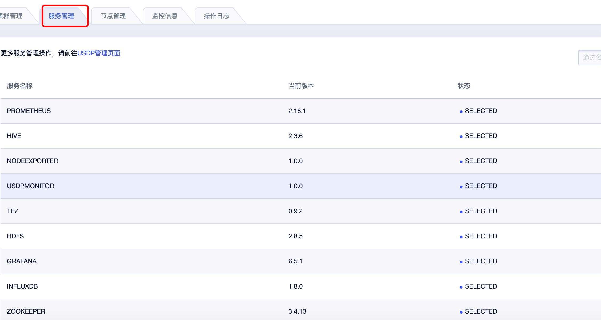

# 服务管理

## 公有云控制台USDP集群“服务管理”

在云控制台USDP集群详情 <kbd>服务管理</kbd> 标签页面，仅支持服务基本信息查看，如下图所示：
    
``关于集群中各个服务管理、配置修改等操作，请您前往“USDP管控控制台”操作。``

USDP的服务管理详情请参考：[USDP服务管理](http://usdp.cn-bj.ufileos.com/USDP用户手册-服务管理.pdf)

