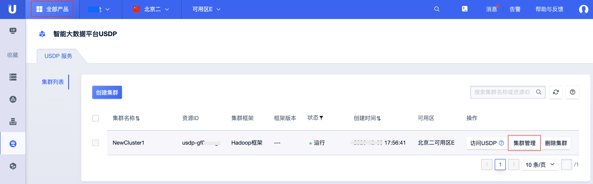
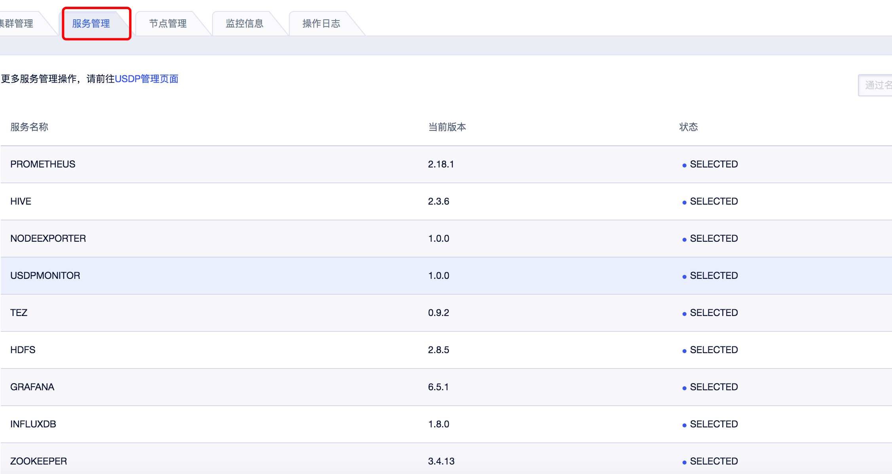
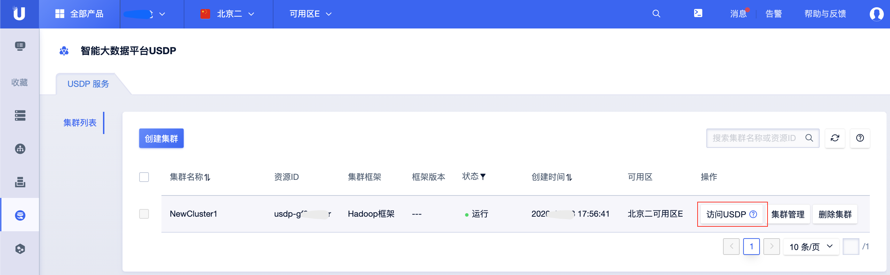
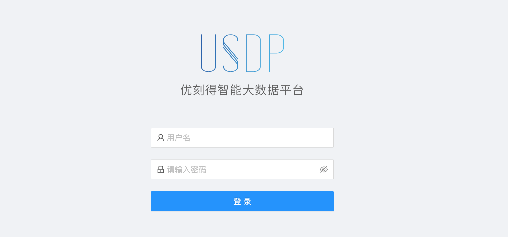

# 服务管理

在智能大数据平台USDP中，为便于用户对集群及相关服务的管理，USDP提供较为友好的服务管理功能，譬如集群资源管理与服务管理的分离管理、大数据服务的基本监控信息查看、服务配置文件修改、服务的组件启停及管理、服务的Web UIs便捷访问等功能，辅助用户更好的管理和使用USDP。

**通过本篇指南，您可以了解到：**

- [在公有云端USDP集群查看“服务管理”](/USDP/operate/service/README?id=在公有云端USDP集群查看"服务管理")
- [在USDP控制台查看集群“服务管理”](/USDP/operate/service/README?id=在USDP控制台查看集群"服务管理")

## 在公有云端USDP集群查看“服务管理”

- 登陆[UCloud云控制台](https://console.ucloud.cn/)。
- 进入首页后，点击左上角“全部产品”，在“数据分析”类目中点击“智能大数据平台USDP”，进入USDP集群管理页面。

- 在已创建的USDP集群条目右侧，点击 <kbd>集群管理</kbd> 按钮，进入USDP集群管理页面，再点击 <kbd>服务管理</kbd> 标签页面，即可查看集群已部署的服务列表信息预览。

 <kbd>服务管理</kbd> 标签页中，仅支持该USDP创建的大数据集群已安装使用的大数据生态服务组件的“服务名称”、“版本”、服务运行“状态”等基本信息查看。

## 在USDP控制台查看集群“服务管理”

关于USDP智能大数据集群中各个服务管理功能、配置修改等操作，均可参考本节指南完成管理工作。

- 在已创建的USDP集群条目右侧，点击 <kbd>访问USDP</kbd> 按钮，进入USDP自有管理控制台。

!>为防止USDP被恶意盗取登陆用户及密码，USDP集群默认的URL会在一定时间后过期，可能会对用户的操作带来些许不便，请谅解。 其他稳定且便捷的访问方式，建议参考 [集群访问及测试-指南](/USDP/operate/access/README) 进行配置。

- 登陆USDP控制台

在USDP控制台左侧导航栏 “服务管理”，USDP已将该集群所部署使用的所有大数据服务组件按以下7类统一归类，可点击前往查看各类中相关组件服务的管理操作方法：

- [计算类服务管理](/USDP/operate/service/compute_kind)
- [存储类服务管理](/USDP/operate/service/storage_kind)
- [监控类服务管理](/USDP/operate/service/monitor_kind)
- [可视化类服务管理](/USDP/operate/service/visual_kind)

对上述各类服务的配置文件管理，USDP有统一的方法说明，请参考如下方法：

- [服务配置文件管理](/USDP/operate/service/service_configer_update)