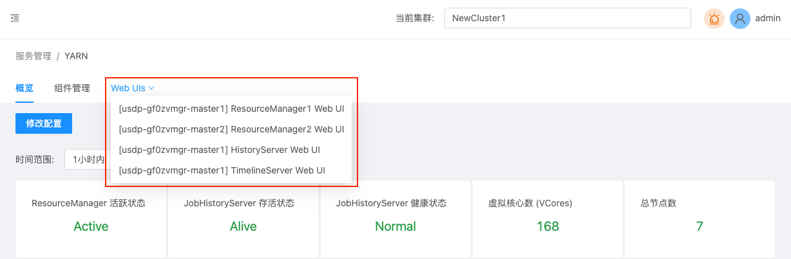

# 计算类服务管理

在USDP-1.0.0.0版本中，集群的计算类服务组件主要有Flink、Flume、Hive、Impala、Kylin、Livy、Phoenix、Presto、Spark、Sqoop、Tez、Yarn在内的11个服务组件，下面将以Yarn为代表，介绍计算类组件的管理操作方式。

- [YARN服务管理](/USDP/operate/service/compute_kind?id=YARN服务管理)
- [其他计算类服务管理](/USDP/operate/service/compute_kind?id=其他计算类服务管理)

## YARN服务管理

点击选择左边菜单导航栏-“服务管理”-“计算类”，在展开的子类中点击“YARN”，即可在右侧窗口打开Yarn的管理页面，如下图所示：

### YARN 服务详情概览

Yarn服务管理首页展示了Yarn服务的监控指标（ResourceManager活跃状态、JobHistoryServer存活状态、JobHistoryServer健康状态、虚拟核心数VCores、总节点数、集群节点存活数量、重启过的节点数量、非健康节点数量、已退役节点数量、丢失节点数量，以及各个节点的监控状态等）如下图所示：

### YARN 服务相关组件管理

参考 [Zookeeper 服务相关组件管理](/USDP/operate/service/storage_kind?id=Zookeeper服务相关组件管理) 方式

### YARN 服务Web UIs便捷访问

鼠标悬停/点击Yarn服务管理页面中“Web UIs”选项卡时，自动下拉展开Yarn相关的页面选项链接，如下图所示：

点击“[udp08] ResourceManager1 Web UI”，会自动在浏览器中打开新的标签页，并显示udp08节点上的ResourceManager管理页面，如下图所示：

点击“[udp08] HistoryServer Web UI”，会自动在浏览器中打开新的标签页，并显示udp08节点上的HistoryServer管理页面，如下图所示：

点击“[udp08] TimelineServer Web UI”，会自动在浏览器中打开新的标签页，并显示udp08节点上的TimelineServer管理页面，如下图所示：

### YARN服务配置文件修改

参考 [服务配置文件管理](/USDP/operate/service/service_configer_update?id=在USDP控制台中更改服务配置文件) 方式。

## 其他计算类服务管理

其他计算类服务还包括Flink、Flume、Hive、Impala、Kylin、Livy、Phoenix、Presto、Spark、Sqoop、Tez等，对这些计算服务的管理方式，均与本篇指南中 Yarn服务管理 的管理方式类似，此处不再过多赘述。

