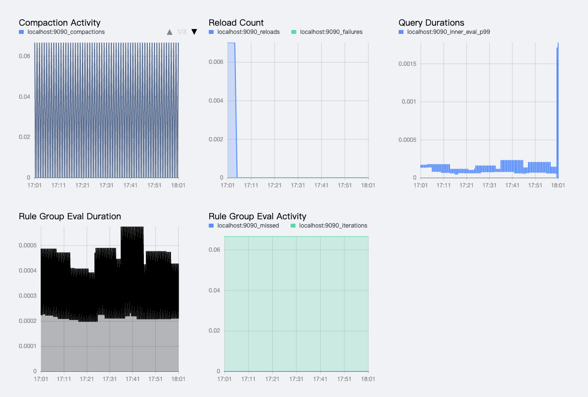
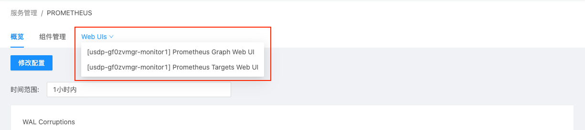

# 监控类服务管理

在USDP1.0.0.0版本中，集群监控类服务组件主要有AlterManager、Grafana、InfluxDB、NodeExporter、Prometheus在内的5个服务组件，下面，将以Prometheus及Grafana为代表展示监控类组件的管理操作，其他组件的管理方式均类似。

- [Prometheus服务管理](/USDP/operate/service/monitor_kind?id=Prometheus服务管理)

- [Grafana服务管理](/USDP/operate/service/monitor_kind?id=Grafana服务管理)

- [其他监控类服务管理](/USDP/operate/service/monitor_kind?id=其他监控类服务管理)

## Prometheus服务管理

点击选择左边菜单导航栏-“服务管理”-“监控类”，在展开的子类中点击“Prometheus”，即可在右侧窗口打开Prometheus的管理页面，如下图：

### Prometheus 服务详情概览

Prometheus服务管理首页展示了Prometheus服务的监控指标（WAL Corruptions、Samples Appended、Scrape Duration、Memory Profile、Active Appenders、Blocks Loaded、Head Chunks、Compaction Activity、Reload Count、Query Durations、Rule Group Eval Duration、Rule Group Eval Activity）如下图所示：

### Prometheus 服务相关组件管理

参考 [Zookeeper 服务相关组件管理](/USDP/operate/service/storage_kind?id=Zookeeper服务相关组件管理) 方式

### Prometheus 服务Web UIs便捷访问

鼠标悬停/点击Prometheus服务管理页面中“Web UIs”选项卡时，自动下拉展开Prometheus相关的页面选项链接，如下图所示：

点击“[udp08] Prometheus Graph Web UI”，会自动在浏览器中打开新的标签页，并显示udp08节点上的Prometheus Graph管理页面，如下图所示：

点击“[udp08] Prometheus Targets Web UI”，会自动在浏览器中打开新的标签页，并显示udp08节点上的Prometheus Targets管理页面，如下图所示：

### Prometheus 服务配置文件修改

参考 [Zookeeper 服务配置文件修改](/USDP/operate/service/storage_kind?id=Zookeeper服务配置文件修改) 方式。

## Grafana服务管理

点击选择左边菜单导航栏-“服务管理”-“监控类”，在展开的子类中点击“Grafana”，即可在右侧窗口打开Grafana的管理页面，如下图：

### Grafana 服务详情概览

Grafana服务管理首页展示了Grafana“服务是否存活”的状态监控。如下图所示：

### Grafana 服务相关组件管理

参考 [Zookeeper 服务相关组件管理](/USDP/operate/service/storage_kind?id=Zookeeper服务相关组件管理) 方式

### Grafana 服务Web UIs便捷访问

鼠标悬停/点击Grafana服务管理页面中“Web UIs”选项卡时，自动下拉展开Grafana相关的页面选项链接，如下图所示：

点击“[udp08] Grafana Web UI”，会自动在浏览器中打开新的标签页，并显示udp08节点上的Grafana管理页面，如下图所示：

!>默认登陆口令如下，请登陆后及时修改密码！ - 用户名：当前集群名称         - 密码：0okm9ijn)OKM(IJN

### Grafana 服务配置文件修改

参考 [Zookeeper 服务配置文件修改](/USDP/operate/service/storage_kind?id=Zookeeper服务配置文件修改) 方式。

## 其他监控类服务管理

其他监控类服务还包括AlterManager、InfluxDB、NodeExporter等，对这些监控服务的管理方式，均与本篇指南中 Prometheus、Grafana服务管理 的管理方式类似，此处不再过多赘述。