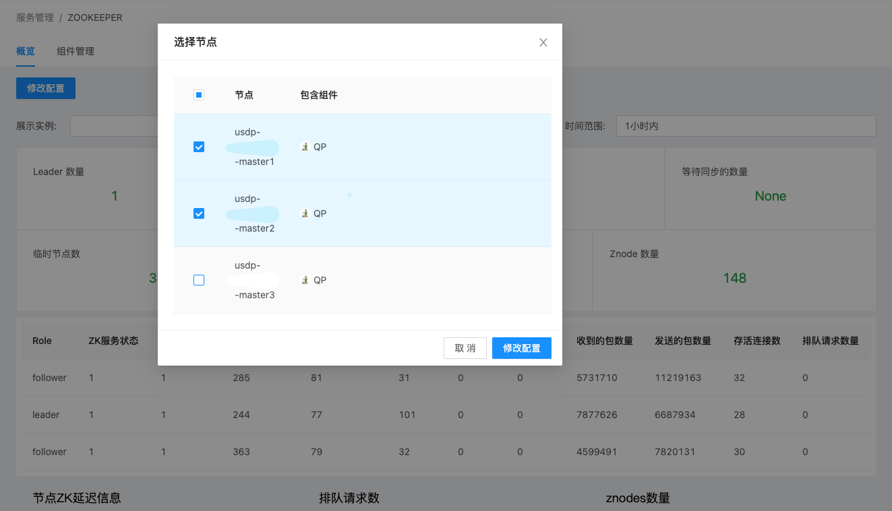
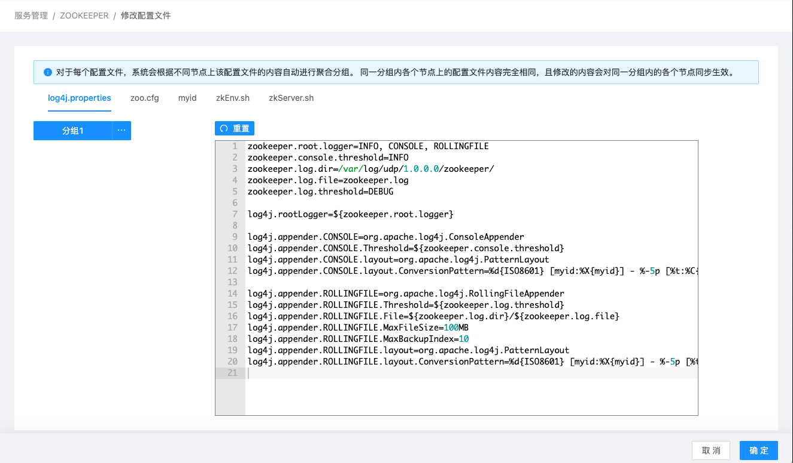
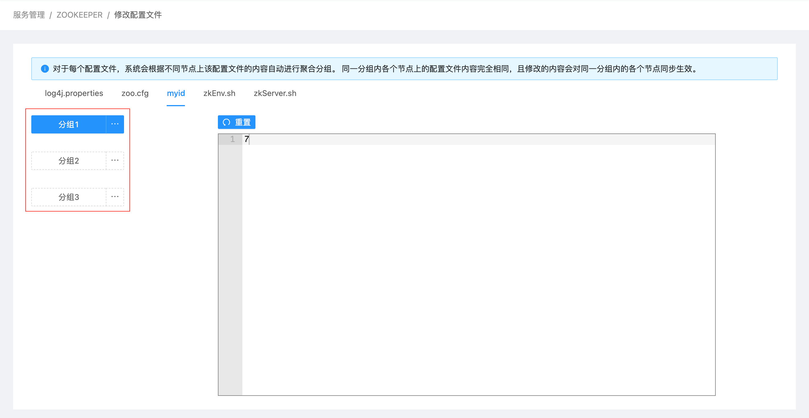
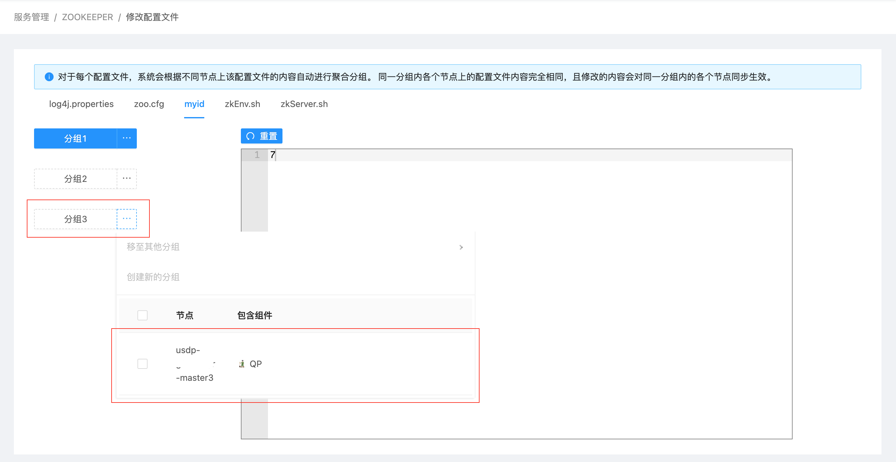
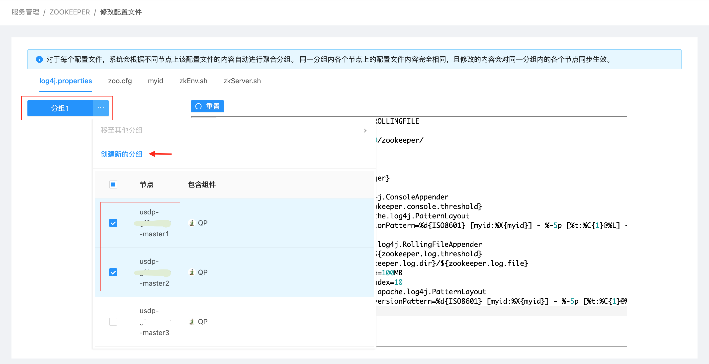
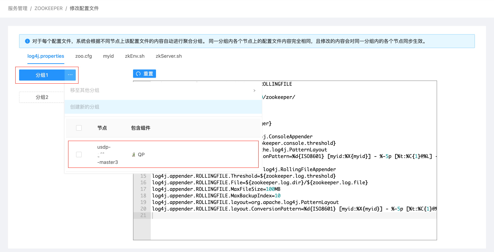
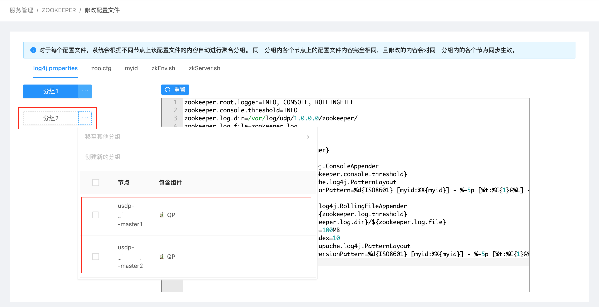
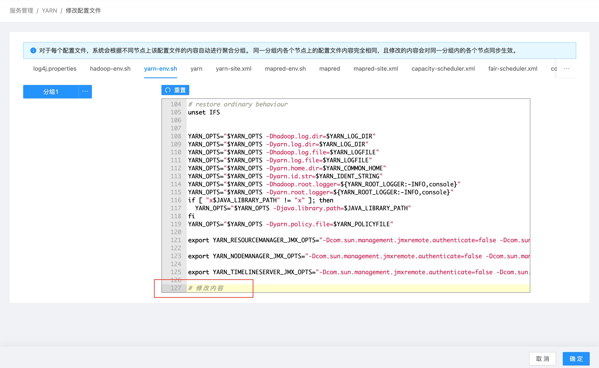

# 服务配置文件管理

在USDP中，无论USDP提供的那种集群组件服务，对于这些服务的配置文件修改，均可采用以下两种方式：

- 在USDP控制台中更改服务配置文件，这是我们强烈推荐方式
- 逐一登陆服务分布式节点并更改其配置文件

**通过本篇指南，您可以了解到：**

- [在USDP控制台中更改服务配置文件](/USDP/operate/service/service_configer_update?id=在USDP控制台中更改服务配置文件)
  - [配置文件默认分组](/USDP/operate/service/service_configer_update?id=配置文件默认分组)
  - [配置文件分组手动调整](/USDP/operate/service/service_configer_update?id=配置文件分组手动调整)
  - [服务组件重启提示](/USDP/operate/service/service_configer_update?id=服务组件重启提示)
- [逐一登陆服务分布式节点并更改其配置文件](/USDP/operate/service/service_configer_update?id=逐一登陆服务分布式节点并更改其配置文件)

下文以Zookeeper的配置文件修改为示例，介绍上述两种修改方式。

## 在USDP控制台中更改服务配置文件

为简化维护人员操作复杂度，USDP支持对同一服务的多个节点配置文件同时进行配置文件修改，亦可对该组件服务的单个节点配置文件进行修改，方法如下：

- 点击Zookeeper服务的 <kbd>概览</kbd> 标签页- <kbd>修改配置</kbd> 按钮，选择需要修改配置文件的节点。如下图所示：

- 在选择节点对话框中勾选好节点后，点击 <kbd>修改配置</kbd> 按钮进入配置修改页面，如下图所示：

USDP会将Zookeeper的所有配置文件内容加载到该页面的编辑框内，您可以翻阅查找需要修改的配置项后进行修改及参数调优。更改好配置文件后，即可点击“确定”按钮保存即可完成修改。

?>注意：以上图示例，一般情况下，Zookeeper对配置文件“Log4j.properties”内容要求在各个节点是一致的，因此，当您选择对Master1、Master2个节点的Log4j.properties文件进行配置修改并确定修改后，此次修改仅对Master1、Master2两个节点同时生效（因为Master1、Master2属于同一个“[分组](/USDP/operate/service/service_configer_update?id=配置文件默认分组)”），但Master3节点未勾选，则需要单独再给Master3节点的Log4j.properties配置文件另行修改操作。

### 配置文件默认分组

USDP支持对同一服务的同一配置文件进行比对和自动分组，避免混乱，遵循以下分组原则：

- 原则1：该服务的多个节点上的同一配置文件内容一致，则默认分配到同一组；

- 原则2：该服务的多个节点上的同一配置文件内容部分不一致的，则按相同的分配一个组，不同的另行分组；

- 原则3：该服务的多个节点上的同一配置文件内容全部不一致的，则每个配置文件单独分配一个组；

分组的意义，是对您在配置文件修改操作时能更好的结合您的调整计划，便于区分某些配置项作用域为局部，而非全局，哪些是全局，而非局部；而且，USDP的分组，是无状态的，即仅对本次配置文件修改时生效，USDP并不记录分组的状态；保存配置文件的修改时，USDP将根据配置文件所在分组，仅在同属该分组的节点上生效更改。

不好理解的话，还是以举例来辅助理解吧~

?>原则1举例：如本篇上文所述，同时对Zookeeper的Master1、Master2节点上的“Log4j.properties”配置文件做修改时，因修改前，这两个配置文件内容一致，因此在进入编辑配置文件页面时，这两个节点自动分配到同一个组(分组1)中（如上图）；对该配置文件的任何修改，保存配置时会自动对该分组中的每个节点按更改后的内容保存。 原则2举例：当完成原则1举例的场景后，此时，Zookeeper的三个节点的“Log4j.properties”文件出现部分不一致情况，即Master1、Master2的“Log4j.properties”文件内容一致，而Master3的与另外两个的“Log4j.properties”文件内容不一致；在这种情况下，再次同时在USDP控制台中对Master1、Master2、Master3的“Log4j.properties”更改时，此时您会发现，出现了两个分组，即Master1、Master2分配一组，Master3独自属于另一组。 原则3举例：譬如Zookeeper的“myid”配置文件，Zookeeper要求各个节点上该配置文件的值均不同，因此，当您修改“myid”配置文件时，您会发现，每个节点均各自归属独立的一个分组。如下图所示：

### 配置文件分组手动调整

当集群节点较少是，对分布式服务的某一配置文件的修改，相对并不复杂；但当集群规模随业务的增长扩容，节点数增至几十、几百时，对部分服务的配置文件统一更改将带来很大不便利，虽然有很多方法，但均容易出错，即使写个脚本批量操作，也将在各种大小BUG中煎熬，而且灵活性不佳。因此，配置文件的默认分组及手动调整分组，就变成一个很灵活很高效好用的实用工具了。

调整分组的方法如下：

- 将当前分组下的一个/多个节点，通过“创建新的分组”、“移至其他分组”的方式，调整原有的分组逻辑，如下图所示：

图解：将“Log4j.properties”的四个节点的其中两个单独创建一个新分组。

- 此时，分组变为两个，且分组2中包含的节点即为上一步操作选择的两个节点，如下图所示：

### 服务组件重启提示

如下图所示，这里对YARN服务的“yarn-env.sh”进行修改（在文件末尾加了一行备注文字），<kbd>确认</kbd> 保存更改后。

此时，左侧导航菜单处“YARN”服务后侧出现橙色叹号警示，提醒您执行服务重启生效。且YARN服务“组件管理”中亦有详细提示，如下图所示：

?>可根据您当前业务的重要性情况，在分析业务低峰期勾选提示项组件，执行滚动重启/批量重启。 部分服务配置文件修改，与其关联性比较强的其他服务可能需要进行重启生效，其他的并非必须重启。

## 逐一登陆服务分布式节点并更改其配置文件

SSH登陆至服务所在节点，参考《各组件服务部署规则说明》- [组件服务配置文件目录](/USDP/developer/rule?id=2.组件服务配置文件目录) 的描述，前往修改相应的配置文件。

譬如Zookeeper的“Log4j.properties”配置文件所在位置参考如下：

~~~shell
[root@usdp-********-master2 conf]# pwd
/etc/udp/1.0.0.0/zookeeper/conf
[root@usdp-********-master2 conf]# ls
configuration.xsl  log4j.properties  zoo.cfg  zoo_sample.cfg
[root@usdp-********-master2 conf]#
~~~