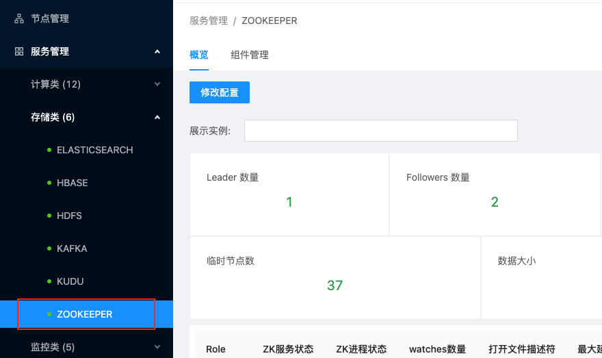
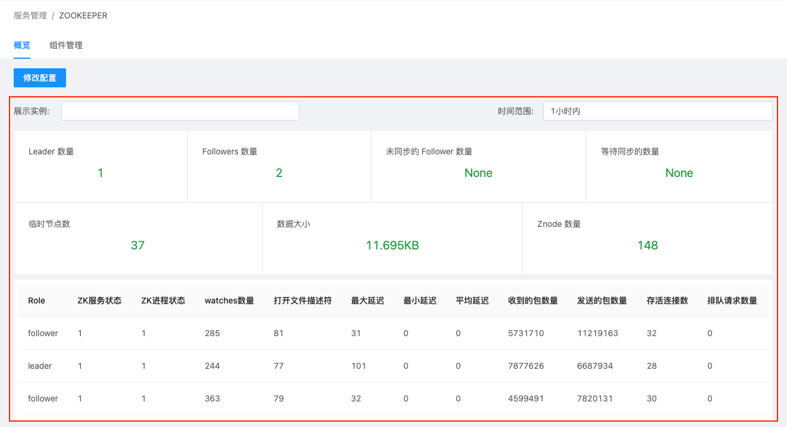

# 存储类服务管理

在USDP1.0.0.0版本中，集群存储类服务组件主要有Elasticsearch、HBase、HDFS、Kafka、KUDU、Zookeeper在内的6个服务组件，下面将以Zookeeper及HDFS为代表展示存储类组件的管理操作方式。

## Zookeeper 服务管理

点击选择左边菜单导航栏-“服务管理”-“存储类”，在展开的子类中点击“ZOOKEEPER”，即可在右侧窗口打开Zookeeper的管理页面，如下图：

### Zookeeper 服务详情概览

USDP会对支持的单个组件服务实现监控，并在USDP控制台进行相关监控指标的可视化展示。

Zookeeper服务管理首页展示了Zookeeper服务的监控指标（Leader数量、Followers数量、未同步的Followers数量、等待同步的数量、临时节点数、数据大小、Znode数量，以及该服务不同角色对应的一些更细致的指标情况）如下图所示：

控制台监控指标可视化支持按时间进行查看，USDP预置了一些时间周期（默认为“1小时内”，还有“6小时内”、“12小时内”、“1天内”、“7天内”、“15天内”、“30天内”），也支持时间周期“自定义”，如下图所示：

### Zookeeper服务相关组件管理

在Zookeeper组件管理页面种，点击“组件管理”选项卡，打开Zookeeper相关组件管理列表，如下图所示：

在该管理页面中，支持对Zookeeper分布的多台节点上的QuarumPeermain组件进行单一/批量节点操作（服务的启动、停止、重启、删除等），如下图所示：

例如，对所有节点上的QuarumPeermain组件进行“停止”运行状态操作时，管理平台将自动检测所选组件当前的工作状态，如下图所示：

例如，对所有节点上的QuarumPeermain组件进行“删除”操作时，管理平台将给您做出警示提醒，请您仔细阅读提示信息，确保此次操作不是误操作。如下图所示：

点击“确认”删除按钮，管理平台将自动检测所选组件当前的工作状态，QuarumPeermain组件正在运行（“已启动”状态）时，是不允许直接删除的。如下图所示：

若确认需要删除所选QuarumPeermain组件，请先“停止”运行，并再次执行“删除”操作。

#### Zookeeper 服务组件扩展

USDP管理控制台支持对当前Zookeeper服务扩展更多节点。如下图所示：

点击“新增组件”按钮，进入“新增组件或服务”向导，如下图所示：

选择QuarumPeermain组件需要扩展的节点主机，如下对话框截图所示：

管理平台检测出，已加入该平台的所有节点主机中，udp02节点上暂未运行QuarumPeermain组件，“勾选”udp02左侧的复选框，点击“确定”按钮，进入“部署信息总览”向导页，如下图所示：

经浏览确认无误，点击“开始部署”按钮，管理平台将为udp02节点安全QuarumPeermain组件，安装无误，将显示安装成功状态，平台会自动启动该组件，如下图所示：

安装进度完成后，点击“完成”按钮。如下图所示：

此时，可根据向导中表单要求，选择需要扩展的新集群节点及服务预览等，最后点击“开始部署”即可完成服务扩展操作。

### Zookeeper服务配置文件修改

USDP支持对同一服务的多个节点配置文件同时进行配置文件修改，亦可对该组件服务的单个节点配置文件进行修改，点击“概览”-“修改配置”按钮，选择需要修改配置文件的节点。如下图所示：

在选择节点对话框中勾选好节点后，点击“修改配置”按钮进入配置修改页面，如下图所示。

USDP会将Zookeeper的所有配置文件内容加载到该页面的编辑框内，您可以翻阅查找需要修改的配置项后进行修改及参数调优。更改好配置文件后，即可点击“确定”按钮保存。

`注意：已上图为例，一般情况下，Zookeeper对配置文件“Log4j.properties”内容要求在各个节点是一致的，因此，当您选择对udp02、udp08、udp09三个节点的Log4j.properties文件进行配置修改并确定修改后，将对该三个节点同时生效。而udp10节点上的Log4j.properties配置文件，则需要另行修改。`

#### Zookeeper 服务配置文件分组

USDP支持对同一服务组件的同一配置文件的不同内容进行分组呈现，避免混乱。支持对分组进行调整（将当前分组下的多个节点，通过“创建新的分组”、“移至其他分组”进行分组调整），如下图所示：

`分组：分组的调整，仅在本次配置文件调整操作时生效，USDP并不记录分组的状态。分组的意义，是对您在配置文件修改操作时能更好的结合您的调整计划，便于区分某些配置项作用域为局部，而非全局。保存修改时，USDP将根据分组中的配置文件，在分组指定的节点上生效。`

如下图所示，已将Log4j.properties配置文件“udp02”及“udp08”节点调整至“分组2”，而“分组1”中包括“udp09”及“upd10”两个节点。

如下图所示，Zookeeper的“myid”配置文件的内容在每个节点上均不同，因此，在配置文件加载时，USDP会自动按照节点，为myid配置文件自动分组。

myid配置分拣“分组1”中包含“udp02”节点，“分组2”中包含“udp08”节点，“分组3”中包含“udp09”节点，“分组4”中包含“udp10”节点，如下图所示：

## HDFS 服务管理

点击选择左边菜单导航栏-“服务管理”-“存储类”，在展开的子类中点击“HDFS”，即可在右侧窗口打开Hdfs的管理页面，如下图：

### HDFS 服务详情概览

HDFS服务管理首页展示了HDFS服务的监控指标（NameNode是否存活、NameNode Active正常、JournalNode是否存活、ZKFC是否存活、Datanode死亡数、Datanode存活数、Datanode心跳超时数、HDFS空间使用率、HDFS块丢失数、Block副本损坏个数、坏盘数量、Block个数、HDFS文件及目录个数、HDFS已用容量、HDFS副本不足的Block数、未分配给HDFS的磁盘大小、可用堆内存、初始堆内存、最大堆内存）如下图所示：

对HDFS GC相关监控（GC5分钟内的频率、GC耗时、GC MarkSweep标记耗时、GC MarkSweep 5分钟标记频率）如下图所示：

对HDFS “堆内存使用大小”的监控，如下图所示：

### HDFS 服务相关组件管理

参考 [Zookeeper 服务相关组件管理](/USDP/operate/service/storage_kind?id=Zookeeper服务相关组件管理) 方式

### HDFS 服务Web UIs便捷访问

USDP管理系统，根据HDFS 自身支持相关Web UI的特性，在集群管理页面提供快速打开其相关的UI的能力。

鼠标悬停/点击HDFS 服务管理页面中“Web UIs”选项卡时，自动下拉展开HDFS 相关的页面选项链接，如下图所示：

点击“[udp08] NameNode1 Web UI”/“[udp09] NameNode2 Web UI”，会自动在浏览器中打开新的标签页，并显示udp08/udp09节点上的HDFS管理页面，如下图所示：

### HDFS 服务配置文件修改

参考 [Zookeeper 服务配置文件修改](/USDP/operate/service/storage_kind?id=Zookeeper服务配置文件修改) 方式。

## 其他存储类服务管理

其他存储服务还有HBase、Kafka、Elasticsearch、KUDU等，对这些存储服务的管理方式，均与本篇指南中 Zookeeper、HDFS 服务管理 的管理方式类似，此处不再过多赘述。

