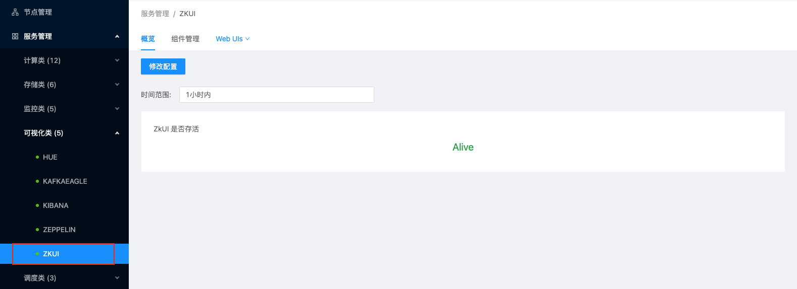

# 可视化类服务管理

在USDP1.0.0.0版本中，集群可视化类服务组件主要有Hue、Kafkaeagle、Kibana、Zeppelin、ZKUI在内的5个服务组件，下面将以ZKUI为代表展示可视化类组件的管理操作，其他组件的管理方式均类似。

- [ZKUI服务管理](/USDP/operate/service/visual_kind?id=ZKUI服务管理)
- [其他可视化类服务管理](/USDP/operate/service/visual_kind?id=其他可视化类服务管理)

## ZKUI服务管理

点击选择左边菜单导航栏-“服务管理”-“可视化类”，在展开的子类中点击“ZKUI”，即可在右侧窗口打开ZKUI的管理页面，如下图：

### ZKUI 服务详情概览

ZKUI服务管理首页展示了ZKUI“服务是否存活”的监控指标，如下图所示：

### ZKUI 服务相关组件管理

参考 [Zookeeper 服务相关组件管理](/USDP/operate/service/storage_kind?id=Zookeeper服务相关组件管理) 方式

### ZKUI 服务Web UIs便捷访问

鼠标悬停/点击ZKUI服务管理页面中“Web UIs”选项卡时，自动下拉展开ZKUI相关的页面选项链接，如下图所示：

点击“[udp08] ZKUI Web UI”，会自动在浏览器中打开新的标签页，并显示udp08节点上的ZKUI登陆管理页面，如下图所示：

### ZKUI 服务配置文件修改

参考 [服务配置文件管理](/USDP/operate/service/service_configer_update?id=在USDP控制台中更改服务配置文件) 方式。

## 其他可视化类服务管理

其他可视化服务还包括Hue、Kafkaeagle、Kibana、Zeppelin等，对这些可视化服务的管理方式，均与本篇指南中 ZKUI服务管理 的管理方式类似，此处不再过多赘述。