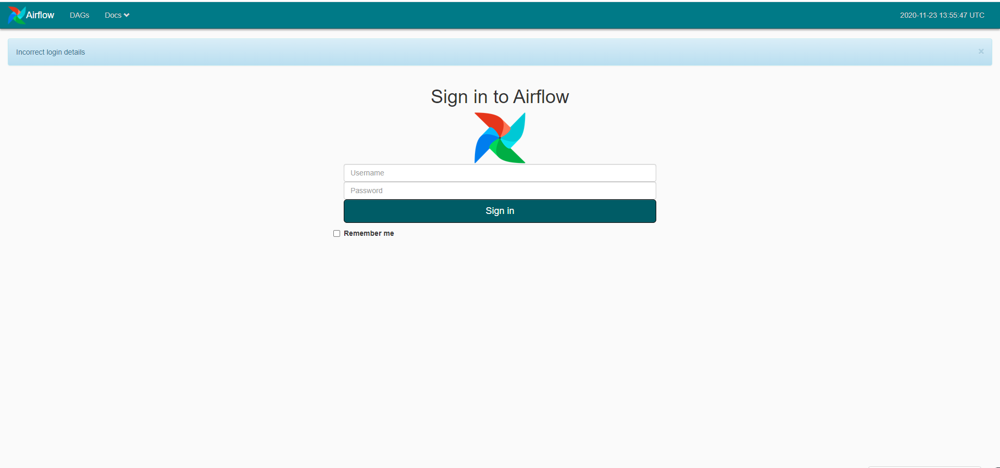
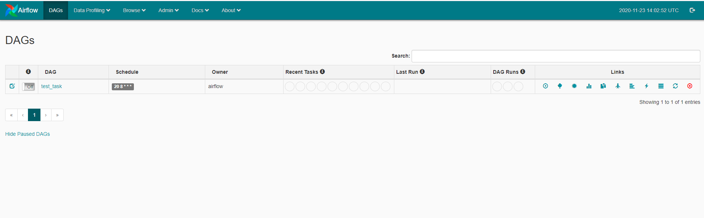
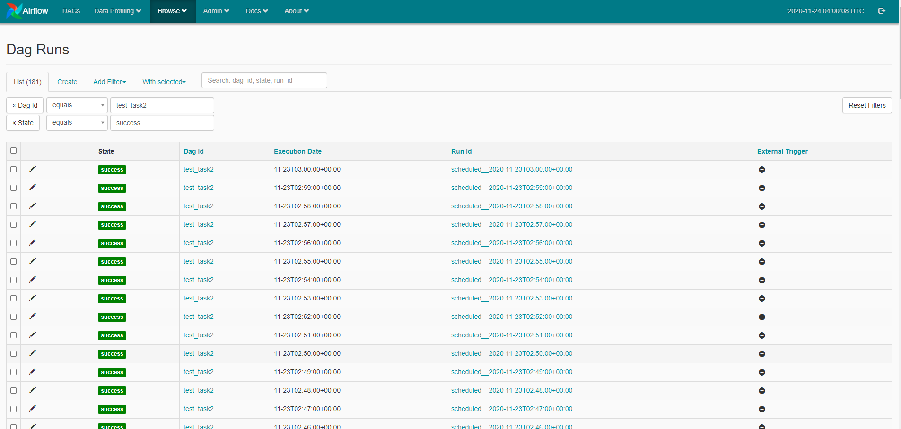

# USDP 任务调度服务-AIRFLOW

Airflow 是一个工作流分配管理系统，它通过有向无环图的方式管理任务流程，可以设置任务依赖关系和时间调度。Airflow 服务会在对应安装节点上启动2个服务，AirflowScheduler和 AirflowWebserver。其中，AirflowScheduler 用于管理所有DAGs、Tasks和Tasks之间的调度。AirflowWebserver 是 Airflow 的 web 服务，用于可视化管理。

- ##  Airflow **基本操作命令**
  - ### 运行自己写的 dags 任务：

    - python3 /srv/udp/1.0.0.0/airflow/dags/tutorial.py

  - ### 查看任务是否运行：

    - airflow list_dags：查看存活 DAG 任务
    - airflow list_tasks tutorial：显示 “tutorial” 任务 dag_id 列表
    - airflow list_tasks tutorial --tree：显示 “tutorial” 任务树状结构

  - ### 测试 dags 是不是可以正常传参

    - airflow test tutorial print_date 2020-11-23

- ## Airflow 的使用实例

设置 Airflow  Web 访问端口为 28999，通过安装节点  IP:28999 访问 ，如 http://106.75.16.72:28999/admin。进入如下界面：



输入默认设置的用户名和密码  hadoop , hadoop。登录如下界面：



在 /srv/udp/1.0.0.0/airflow/dags/  放入需要执行的 dag 任务代码 example2.py ，刷新 DAGS 页面， 示例代码如下：

```python
# -*- coding: utf-8 -*-
from datetime import datetime, timedelta

from airflow import DAG
from airflow.utils import dates
from airflow.utils.helpers import chain
from airflow.operators.bash_operator import BashOperator
from airflow.operators.python_operator import PythonOperator


def default_options():
    default_args = {
        'owner': 'airflow',  # 拥有者名称
        'start_date': dates.days_ago(1),  # 第一次开始执行的时间，为 UTC 时间
        'retries': 1,  # 失败重试次数
        'retry_delay': timedelta(seconds=5)  # 失败重试间隔
    }
    return default_args


# 定义DAG
def test1(dag):
    t = "pwd"
    # operator 支持多种类型， 这里使用 BashOperator
    task = BashOperator(
        task_id='test1',  # task_id
        bash_command=t,  # 指定要执行的命令
        dag=dag  # 指定归属的dag
    )
    return task


def hello_world_1():
    current_time = str(datetime.today())
    print('hello world at {}'.format(current_time))


def test2(dag):
    # PythonOperator
    task = PythonOperator(
        task_id='test2',
        python_callable=hello_world_1,  # 指定要执行的函数
        dag=dag)
    return task


def test3(dag):
    t = "/srv/udp/1.0.0.0/yarn/bin/yarn jar /srv/udp/1.0.0.0/yarn/share/hadoop/mapreduce/hadoop-mapreduce-examples-2.8.5.jar wordcount /input /out_`date '+%Y-%m-%d-%s'`"
    task = BashOperator(
        task_id='test3',
        bash_command=t,
        dag=dag)
    return task


with DAG(
        'test_task1',  # dag_id
        default_args=default_options(),  # 指定默认参数
        schedule_interval="20 8 * * *"  # 执行周期
) as d:
    task1 = test1(d)
    task2 = test2(d)
    task3 = test3(d)
    chain(task1, task2, task3)  # 指定执行顺序
```

页面刷新后，存在  test_task2 DAG，查看运行 task 如下图：



