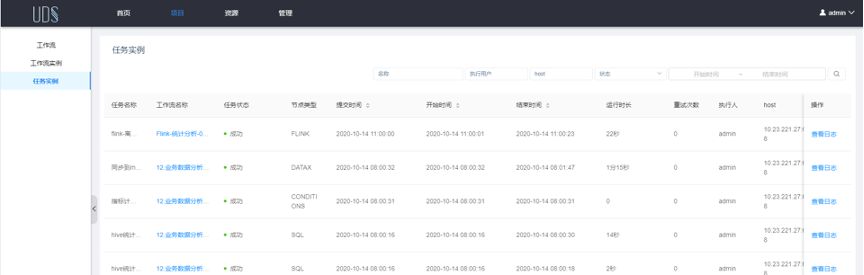
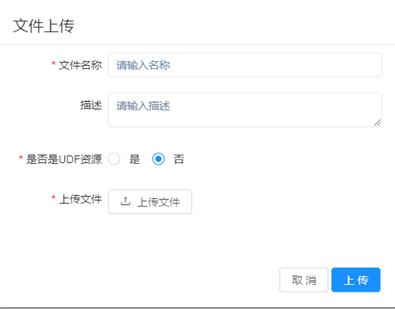
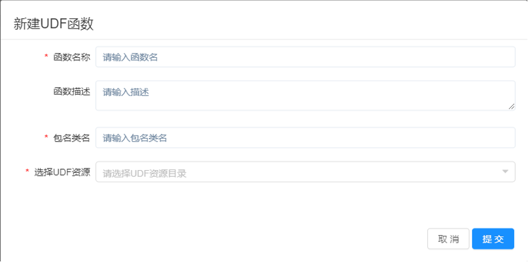

# USDP 任务调度服务-UDS

UCloud Data Studio（简称 UDS），是 UCloud 推出的智能化、轻量级的大数据任务调度管理服务，能够帮您快速高效实现大数据的分析任务管理能力。

## 1. 登录UDS控制台

点击 USDP 控制台左侧导航菜单 <kbd>服务管理</kbd> - <kbd>调度类</kbd> - <kbd>UDS</kbd> ，进入UDS详情页，点击 <kbd>Web UIs</kbd> 即可打开当前集群的 UDS 任务管理服务控制台。

UDS管理员账号，参见 [各服务Web UIs登录账号](/USDP/operate/login) 指南文档。

## 2. 概览（Dashboard）

进入UDS后，展示给用户的第一个页面，即为 Dashboard 页，其中显示了该用户（非管理）所有项目的重点指标、任务状态、当天任务完成情况、运行时长TOP5和任务失败TOP5。如下图所示：

用户可通过顶部提供的工具进行时间、项目的筛选，便于快速查看整体情况，如下图所示：

## 3. 项目模块

UDS所有的任务管理，均按照项目进行划分，接下来将介绍 “项目” 模块的使用方法。

### 3.1 创建项目

点击"项目"进入项目管理页面，点击“创建项目”按钮，输入项目名称，项目描述，点击“确定”，创建新的项目。

### 3.2 进入项目

点击项目名称或者在操作栏点击进入项目，可以进入项目详情

### 3.3 创建工作流

进入项目详情后，在工作流列表，点击“创建工作流”，进入工作流定义页面

#### 3.3.1 添加任务

##### 3.3.1.1 SHELL\PYTHON\SQL任

将工具栏中的组件拖拽到右侧画布中创建任务，其中SHELL、PYTHON、SQL任务拖入画布后，可以双击进入编辑页面

##### 3.3.1.2 数据集成任务

将工具栏中的数据集成组件（DI）拖入到画布中，双击进入编辑页面

左侧节点设置栏可以设置数据集成节点的基本信息，切换至集成组件tab，可将数据集成的来源数据源、转置组件和目标数据源拖拽至画布中。

使用连线工具，将来源、转置和目标组件连接起来。

双击任意组件，可打开编辑页面

##### 3.3.1.2 其他任务

其余类型任务可以直接在右侧填写节点信息

#### 3.3.2 删除任务

在任务上点击鼠标右键，删除

#### 3.3.3 添加任务执行的先后顺序

点击左上角图标 <kbd>\\</kbd>连接任务；如下图所示，任务2和任务3并行执行，当任务1执行完，任务2、3会同时执行。

#### 3.3.3 删除依赖关系

点击左上角 “选中” 图标，选中连接线，点击右上角 "删除"图标，删除任务间的依赖关系。

### 3.4 保存工作流

点击左上工具栏的“保存” 图标，然后填写名称、描述等信息

### 3.5 工作流操作

> - 编辑： 只能编辑"下线"的工作流定义。工作流DAG编辑同[创建工作流定义](https://dolphinscheduler.apache.org/zh-cn/docs/1.3.2/user_doc/system-manual.html#creatDag)。
> - 上线： 工作流状态为"下线"时，上线工作流，只有"上线"状态的工作流能运行，但不能编辑。
> - 下线： 工作流状态为"上线"时，下线工作流，下线状态的工作流可以编辑，但不能运行。
> - 运行： 只有上线的工作流能运行。
> - 定时任务： 只有上线的工作流能设置定时，系统自动定时调度工作流运行。定时任务状态为开启时才会执行。
> - 删除： 删除工作流定义。
> - 下载： 下载工作流定义到本地。
> - 树形图： 以树形结构展示任务节点的类型及任务状态

### 3.6 运行工作流

只有***上线***状态的工作流才能运行，点击“运行”按钮，弹出启动参数设置弹框

> **失败策略：**当某一个任务节点执行失败时，其他***并行***的任务节点需要执行的策略。”继续“表示：某一任务失败后，其他任务节点正常执行；”结束“表示：终止所有正在执行的任务，并终止整个流程。
>
> **通知策略：**当流程结束，根据流程状态发送流程执行信息通知邮件，包含任何状态都不发，成功发，失败发，成功或失败都发。 
>
> **流程优先级：**流程运行的优先级，分五个等级：最高（HIGHEST），高(HIGH),中（MEDIUM）,低（LOW），最低（LOWEST）。当master线程数不足时，级别高的流程在执行队列中会优先执行，相同优先级的流程按照先进先出的顺序执行。 
>
> **worker分组：**该流程只能在指定的worker机器组里执行。默认是Default，可以在任一worker上执行。 
>
> **通知组：**选择通知策略||超时报警||发生容错时，会发送流程信息或邮件到通知组里的所有成员。 
>
> **补数：**包括串行补数、并行补数2种模式。串行补数：指定时间范围内，从开始日期至结束日期依次执行补数，只生成一条流程实例；并行补数：指定时间范围内，多天同时进行补数，生成N条流程实例。

### 3.7 工作流实例

工作流运行后生成一条工作流实例，项目-工作流实例列表显示所有的工作流实例

#### 3.7.1 工作流实例功能

> **重跑：** 重新执行已经终止的流程。
>
> **恢复失败：** 针对失败的流程，可以执行恢复失败操作，从失败的节点开始执行。
>
> **停止：** 对正在运行的流程进行停止操作，后台会先killworker进程,再执行kill操作
>
> **暂停：** 对正在运行的流程进行暂停操作，系统状态变为等待执行，会等待正在执行的任务结束，暂停下一个要执行的任务。
>
> **恢复暂停：** 对暂停的流程恢复，直接从暂停的节点开始运行
>
> **删除：** 删除工作流实例及工作流实例下的任务实例
>
> **甘特图：** Gantt图纵轴是某个工作流实例下的任务实例的拓扑排序，横轴是任务实例的运行时间

### 3.8 任务实例

单独运行任务或运行工作流后，会生成任务实例，项目详情-任务实例列表会显示所有任务实例

#### 3.8.1 查看任务日志

点击“查看日志”按钮，可以查看任务运行产生的日志

## 4. 资源模块

### 4.1 数据源

#### 4.1.1 新建数据源

资源-数据源列表，点击“新建数据源”，填写数据源相关信息，测试连接成功后可添加。

### 4.2 文件

#### 4.2.1 上传文件

资源-文件列表，点击“上传文件”

填写文件名称和描述，选择是否是UDF资源，UDF资源是新建UDF函数时所需的资源。

### 4.3 UDF函数

#### 4.3.1 新建UDF函数

填写函数名称、描述、包名类名，选择UDF资源，UDF资源需提前上传。

新建好的UDF函数可以在HIVE的SQL查询中使用

## 5. 管理模块

### 5.1 用户管理

用户分为管理员用户和普通用户，管理员拥有全部权限。普通用户可以创建项目和对工作流定义的创建，编辑，执行等操作，没有管理权限。初始admin账户为管理员，其余所有创建的账号均为普通用户。

#### 5.1.1 新建用户

在管理-用户管理列表，点击“新建用户”，弹窗填写用户基本信息

#### 5.1.2 授权项目

点击“授权项目”，从现有的项目中选择项目授权给该用户，只有拥有项目权限的用户才能进入该项目进行创建工作等操作。

#### 5.1.3 授权数据源

点击“授权数据源”，在弹窗中选择需要授权的数据源，用户在工作流中只能访问已获得授权的数据源。

#### 5.1.4 授权文件

在更多操作中，点击“授权文件”，选择文件授权给指定用户。

#### 5.1.5 授权UDF资源

在更多操作中，点击“授权UDF函数”，选择UDF函数授权给指定用户。

### 5.2 告警组管理

告警组是一组用户的集合，用于任务执行发生异常（或任务已完成）时，邮件通知该组用户。

#### 5.2.1 新建告警组

在管理-告警组管理列表中点击“新建告警组”，弹窗填写组名称，选择人员后提交。

添加好的告警组可以在运行工作流的参数弹窗中选择

